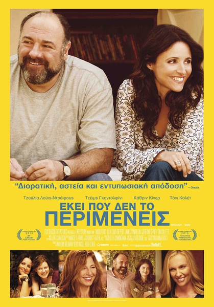
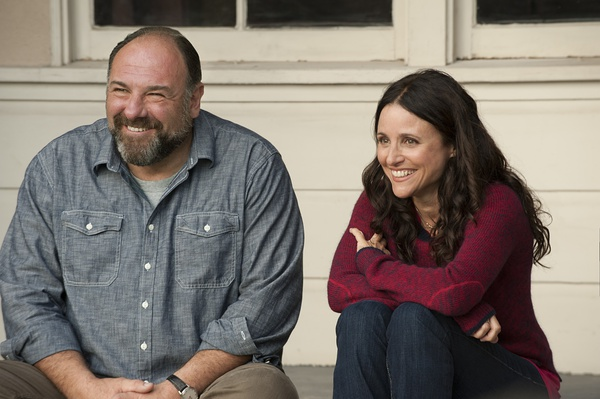
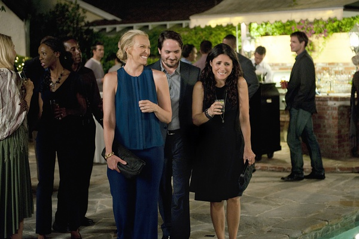

《无须多言 Enough Said》

			

老公的评论：

　　忘了为什么要看这部电影了，查了一下资料，发现这部电影是2013年的，估计是因为那个时候我还是个胖子，所以找了一部封面显示是胖子的爱情故事的电影吧。

　　这部电影内容倒是其次，最让我惊叹的是女主人公在拍这部电影的时候已经五十出头了，虽然看得出她不是很年轻，而且她在电影中演的也是一个大学生的妈妈，但是真的看不出她五十多了。化妆或许会让人看上去年轻，但是她的表情、肢体语言都不像一个所谓的奶奶辈儿的老人家，厉害！

　　这部电影的题材还是挺有特点的：一个离婚女人结识了一个好姐妹，同时又新交了一个男朋友，但是她没想到她的好姐妹整天向她抱怨的前夫就是自己的新男友……，演员、台词都不论，即便只是这个概念，就足以让我这样的观众构思出很多桥段了。

　　这部电影并不算是一部喜剧，甚至恐怕连爱情片都算不上，就是那么一个生活伦理剧，却让我们能够认真的看完……

　　我其实不是很明白故事的结尾想要表达的是什么意思，是两个人愿意在一起还是不愿意在一起？不过，无论解决是否圆满，都不影响这个故事给我留下的深刻印象了。

老婆的评论：

　　没想到的是，这部电影的主人公年龄这么大，太显年轻了。

　　结局是什么意思呢？两人又要在一起？

　　专业按摩师Eva（茱莉亚·路易斯-德瑞弗斯饰）在一次聚会上，认识了一个中年离婚男人Albert（詹姆斯·甘多菲尼饰），他们开始约会。同时，女诗人Marianne也成为Eva的客户，她们什么都聊，在不断的交谈中，Eva知道她是Albert前夫，她不但没有回避，还不停的去追问Albert的事情。

　　终于一天，Albert和Eva在Marianne中相遇，互相尴尬，Albert在知道Eva很早以前就知道Marianne是他的前妻时，生气了，他拒绝与Eva发展。

上映年份 2013							
		
http://blog.sina.com.cn/s/blog_52187ba90102wse6.html
