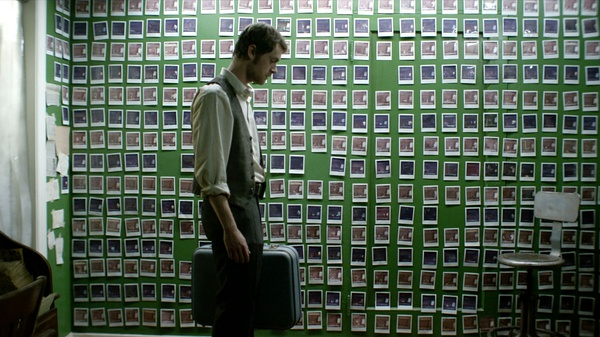
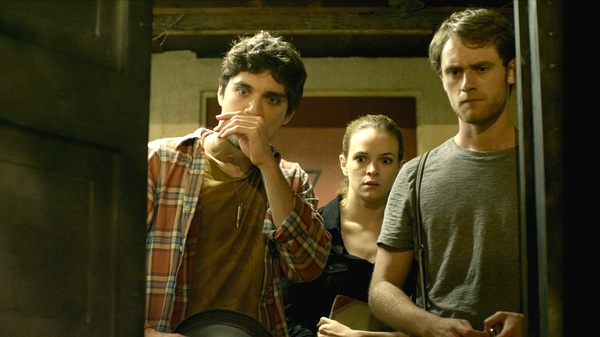

《时光穿梭 Time Lapse》

			

老公的评论：

　　这个故事借助了科幻的概念，却并非真正的科幻题材。

　　那部照相机并非拍下了未来的景象，而是它拍摄下的景象一定会成为未来——否则赛狗的事件也就根本不会发生了——这也导致了三位主人公盲目地根据照片的内容去安排生活，真搞不懂这到底是一种幸福还是一种诅咒。

　　故事有一点点漏洞：如果照相机早晚各拍一张照片的话，那么女主角是怎么保证每一次她都先到，从而让两位男主角无法发现“白天照片”的呢？

　　如果非要定义成科幻的话，这部电影没有一丁点关于科幻或者时空穿越的特效，所以，很多这种小成本的关于时空理论的电影大多讲的都是因果关系……，所以，这部电影的结尾更像是一部恐怖片的开始——这样一部“语言机器”如果真的存在的话，那么世界会变成什么样？

　　有些迷惑这部电影想告诉我们的是“未来可以预知”还是“未来无法改变”！

老婆的评论：

　　现在的电影就这么喜欢用很少的几个人把电影拍完？

　　有的遗憾，这个科幻的概念，我又不是很懂，所以，即便这是一部非常好的科幻电影，我也不能完全融入进去。

　　到底是机器左右了这三个主人公？还是这三个主人公本身就有贪念导致后来的一切。

　　当女主人公想要改变结局时，可结果不管是意外导致或者是必然她都无法改变了，那两个男主人公死了。以为能改变的结果并不代表一定能改变。

　　从某种意义上来说，这是一部好电影，我觉得抛开科幻的因素，这也带给人思考的一部电影，关于人性的考验，我们经常要面对，如果你是这部电影的主人公，你会做何种选择？

　　我以为，大部分人都会像这部电影的主人公一样，这大概就是人性。

上映年份　2014							
		
http://blog.sina.com.cn/s/blog_52187ba90102w7kp.html
