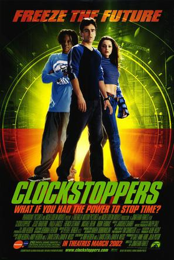

《时光骇客 Clockstoppers》

			

老公的评论：
 

　　2002年的老电影，在今天看来虽然没有那么精彩，但是也没有那么过时，算是一部青春喜剧吧，而且里面的科幻元素虽然简单甚至是缺乏合理性，但是留给我很丰富的想象空间。
 

　　不由得想到了基纽特种部队的“时间停止”，其实能让时间静止真的是个有趣的话题，这四个字表面上看起来只是一个科幻的概念，但是我觉得提到这四个字的时候，我们每个人都会好像看到了一幅画面，这种文字的画面感是一种很有趣的现象，好的文字作品可以通过画面感让读者异常投入。
 

　　科幻电影还有一个有趣的地方，就是容易让人联想，如果你我拥有了那块手表，我们会做什么么？去银行？去恶搞我们讨厌的人？可是怎么解决会在超时间里变老的问题呢？液氮真的可以放慢超时空履行的人吗？是不是我们都得预备点液氮枪？
 
　　写着这个影评，我还是觉得“时间静止”的画面总不停地跳到我的脑海中，有点意思，考虑改行去学物理了……

老婆的评论：
 

　　有点幼稚的影片，但那个关于超时间的概念倒是有点意思，所以说不上喜欢，也说不上多不好看，如果有别的选择时，这部电影可以放放。
 

　　主人公扎克的爸爸是一位教授，他的学生（叫什么给忘了，是位科学家）寄了一块可以控制时间的表给他，需要他解决由于加速导致人变老的难题。让扎克得到了。扎克刚好在其新女的朋友弗朗西斯卡家，无意中，他发现这块表的神奇之处，并与弗朗西斯卡分享，他们俩帮助了扎克的好友赢得了比赛，在路上恶搞坏孩子……。
 

　　当然，一切没那么简单，电影中的反派出场了，他们是超时间研究中心的特工们，他们来取这块表，并抓了扎克的爸爸，并通缉了扎克及那位科学家，扎克在弗朗西斯卡和那位科学家的帮助下，救出了他爸爸。
 
　　有点意思的是，那位科学家，后来又变小过了，成了高中生的长相了。							
		
http://blog.sina.com.cn/s/blog_52187ba901016gw3.html
