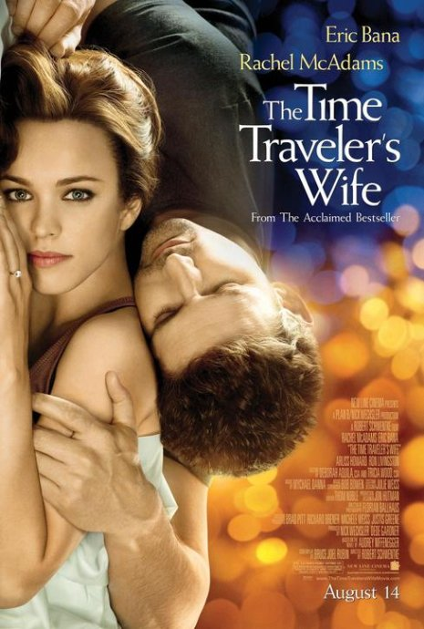
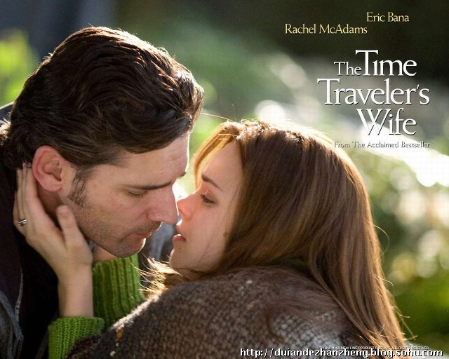
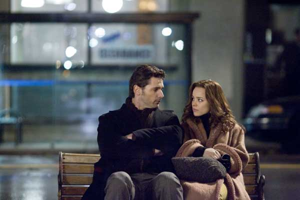

《时间旅行者的妻子》

			【夫妻影评】《时间旅行者的妻子 The Time traveler's Wife》

老公的评论：
 
　　在看过并向朋友们推荐的时候，我和老婆一直把这部片子定义为文艺片。
 

　　虽然，我认为这部电影牵扯到了穿越时空的概念，但基本与科学无关，就如同在琼瑶的《庭院深深》的第一句前边加上一句“火星历，西元100001年”一样，那不会把一部言情小说变成科幻小说。
 

　　错乱的时间，错乱的接触，因果关系的颠倒，视“弑母理论”为无物……，这些都无法掩盖这部电影的优秀，不知道这样一部电影怎么没有流传开。
 

　　整部电影，一直给人一种淡淡的感觉，淡淡的甜蜜，淡淡的神秘，淡淡的温馨，淡淡的搞笑……，甚至连结尾，你也分不清是淡淡的哀伤还是淡淡的欢喜……
 
　　强力推荐！
 

老婆的评论：
 
　　电影的好不好看？不一定都是大腕，不一定要花哨的场面，更不在于是否让你有身历其境的3D感觉。最终还得落实在情节上。
　

　　这部影片的故事情节，安排的真的很好，非常的温馨感人。虽然也运用我不太喜欢的那种过去，现在和未来时间交替的拍摄手法。但在这部影片中不觉得讨厌。
 

　　老公一直幻想能与我穿越回到过去，一起去看看我小时候的样子，我也很希望能回到过去，给自己讲点什么道理，或者人生能少走很多的弯路。
 

　　我喜欢女主人公的执着，从6岁开始喜欢一个男人，一直不曾动摇过，不管男主人公是否经常失踪连自己都不知道要去哪里？！连结婚典礼都是两个不同时期的自己……，这点可能是心灵传送者不好的地方吧。
 

　　关于他们两个深情的体现，是女主角要为男主角生一个孩子，而男主角为了妻子不受伤害而自己去做结扎术，却不知道这个对他自己根本起不到作用。发现自己妻子再次怀疑的异样时那段对话，很有意思，大家要是看的话，值得留意一下。
 

　　我想两个相爱的人，有他们那般也该是知足了，可惜，结局是他英年早逝，或许这样安排会给观众更多的震撼力吧，但我总喜欢更喜剧一些。
 
 
上映年份 2009

导演
Robert Schwentke
罗伯特·施温特克
 
主演

Henry……Eric Bana
亨利……艾瑞克·巴纳
Clare……Rachel McAdams
克莱尔……瑞秋·麦克亚当斯							
		
http://blog.sina.com.cn/s/blog_52187ba90100hy9a.html
