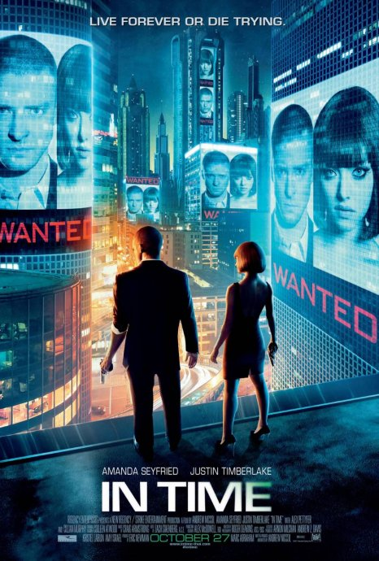
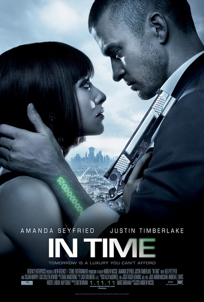

《时间规划局　In Time》

			

 老公的评论：
 
　　首先，要说的是，这部电影中有我们的熟人，《美眉校探》中的Amanda
Seyfried，因为看了那么多的电影与电视剧，遇到熟人或者在影视作品中找熟人已经成为了我们的乐趣之一。对了，还有个熟人，就是在电影初期给了主角一个世纪生命的那位，在《猫鼠游戏》和《超市特工》里都有他的身影，很帅。
 

　　其次，在写影评之前，我去网上查了查，发现很多看过这部电影的朋友都去探讨这部电影到底映射了什么样的政治内容，挺有意思的，在我看来，电影就是电影，是虚构的，那些能从文艺作品中找到政治内涵的朋友都是政客吧。
 

　　再次，我觉得这部电影的创意很好，不过中文名称翻译的很烂，电影中所谓的“时间”好像和现实中的时间还是有些不同吧，电影中的时间更多地指的是“生命”，这点很有意思。
 

　　其实从娱乐的角度，我们完全可以把这个电影里面所描写的场景、感觉当成是在拍摄另一个维度空间里的故事，在我们的世界当中，人体的器官可以移植，但是在另外的某个维度之中，也许生命真的是有形的，真的是可以移植的，从这个感觉去看这部电影，才叫科幻。

　　从科幻的角度来看，我觉得生命的有形也许是真的，这样“卖命”这个词才有真的意义。
 

　　最后，想说这部电影中虽然并没有什么特效，但是从科幻的角度却给我带来了一种不一样的感觉。现在的电影，大多数已经不再考虑电影的文艺属性了，靠声光效果，和动画片有什么区别，看电影，看的是那些演员为我们演绎出的好故事。感谢这部电影的原创或者是编剧，让我在“生命有形”这一个概念里找到了知音。

 

老婆的评论：
 

　　我也很想你问我年纪时，是问你过了多久的25岁？永远的25岁不是挺好吗？！虽然我看见电影的女主人公Sylvia一家，奶奶、爸爸、妈妈和她一样年轻时感觉很怪异，但也不妨碍我对永远的25岁的向往。
 

　　生命就是金钱，你赚取的生命，你花费的也是生命，这一概念我觉得不错哦。只不过，本片在处理如何支付生命这种消费时我觉得太容易了，强盗抢劫生命也太容易了，除了富人区，穷人的生命根本就没有保障，很轻易的就被抢走了，这一点还需要再构思一下。
 

　　我想富人都愿意去这个世界吧，只要你小心不意外死亡，要想再活500年，没有问题，说不定你将永生！只不过，我看Sylvia的爸爸太吝啬了，他自己好几千岁的生命他的保险箱里还有一百万年，而不愿意为他女儿付一千岁的赎金，这一点我很难理解，对一个将永生的人来说，亲情不是很重要吗？吸血鬼们生命都长，但他们都希望有人来陪。
 

　　电影的主人公Will也是一个很逗的人，他总把自己搞的紧张兮兮的，总是给自己留一天的时间。而他从富人区劫来Sylvia后，两人居然干起抢劫Sylvia的爸爸的生命银行，把时间分给穷人，还是只给自己留一天的时间。

上映年份：2011年							
		
http://blog.sina.com.cn/s/blog_52187ba901010x3k.html
