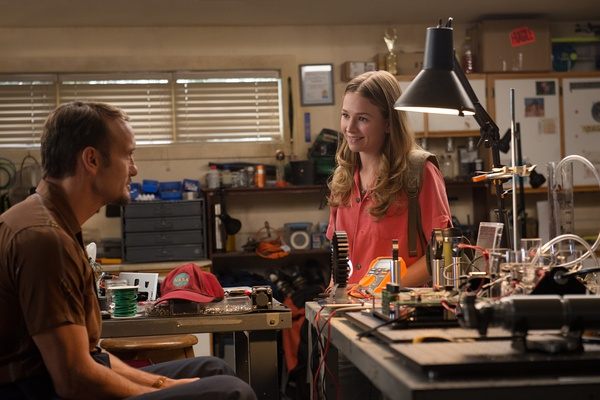

《明日世界 Tomorrowland》

			

老公的评论：

　　我很少觉得电影应该承担很多现实的责任，所以我只把这部电影当做是一部电影，没把它当做迪斯尼的广告，也没有真的把它所讲述的内容和现实百分之百的联系到一起，因为真的没必要。

　　乔治·克鲁尼如果不扮帅的话，我觉得要减分不少，他所扮演的大叔有点太“大叔”了，我觉得这部电影的看点不在他而在包括女一在内的那几个“小朋友”，特别是那位饰演雅典娜的小姑娘，能演的这么好，很有意思。

　　从个人角度而言，我并不觉得未来科技发展的一定都表现在能源动力方面，我认为科技发展的根本一定在于和人的生活密切相关，所以我觉得未来科技的大部分体现也一定在家居生活方面，这部分我觉得电影体现的不够。

　　让我觉得有突破点的地方在于电影中对于虚拟现实场景做了更深入的诠释，这个还是挺有意思的，如果这种虚拟现实场景真的能够实现的话，等于就是实现了维度的穿越，这是我向往的旅游、出行方式。

　　想不通这部电影的票房为什么那么差，就是因为它是一部广告电影吗？

老婆的评论：

　　其实我没太看懂，那个明日的世界到底是平行世界？把优秀的人才招聘到未来世界，从而来改变现在的地球？

　　我在看到凯西（布丽特妮·罗伯森饰）拿到纪念章寻找明日世界走到水里时，觉得真好笑。

　　弗兰克（乔治·克鲁尼饰）那么小的时候就能制造喷雾飞翔机，让我又一次感慨，美国的小孩怎么都是发明家？

　　雅典娜把凯西和弗兰克带到一个不一样的世界，他们在那边看到了地球的毁灭，又想通了，是因为这个不同世界的机器导致的，雅典娜自毁消灭了改机器，那个怪博士死了，明日世界又开始新一轮的招募。

　　我想人的思想真是很强大，关于外星，关于未来，关于平行世界，我们都在思想层面，构思和创造了无数多，那么这些会不会因为人类的想象而产生？

上映年份　2014							
		
http://blog.sina.com.cn/s/blog_52187ba90102w7ko.html
