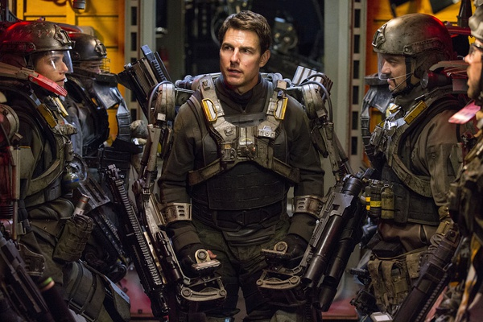

《明日边缘 Edge of Tomorrow》

			

 
老公的评论：
 
　　这是我看过的电影中，主人公死亡次数最多的一部。
　　这是我看过的电影中，主人公死亡次数最多，但是却让人很开心的一部。
　　这是我看过的电影中，主任公死亡次数最多，但是我却一直盼着他别死的一部。
 
　　克鲁斯真的老了，所以这部电影的卖点我认为也不是动作和他的帅，而是真的有情节的规划。
 

　　这种“时间循环”的桥段出现在影视作品中已经不是第一次，甚至不是第一百次了，但是《明日边缘》显得更有创意一些，更像是一个游戏，真的很像，想起了小时侯玩儿任天堂，在某个地方死了，下次记住了多走一步再跳就能过关……，能把电影和游戏用这种真正的内涵连接起来，真的很棒！
 
　　对于这样一部动作类的电影，谈论太多的内容就太剧透了，真的节奏很快，很好笑，看看吧！
 
　　这个电影我感觉不适合去电影院，因为要和身边的人边讨论边看才有意思。

老婆的评论：
 

　　一次一次一次又一次，更多次的在同一天复活，主人公威廉·凯奇少校是一种怎么样的心情？估计比我要过同一关游戏更无语吧。更惨的是，这个战场他根本就不愿意去，被逼的，又一上战场就神遇，对他来说既是赐福又是诅咒。
 
　　还好的，他遇到有过同一种经历的女战士丽塔·沃拉塔斯基，这样他不要那么寂寞和无助了。
 

　　结尾部分还神奇，威廉·凯奇回到了最初要去见将军那会，这次他乖了，直接以军官的身份去了基地，他看着丽塔·沃拉塔斯基这么亲密的战友，可丽塔·沃拉塔斯基还不认识他呢，很奇怪的感觉。
 
　　总的来说，这样一个题材的电影能拍成这样好看真难得，我非常喜欢这部电影。

上映年份　2014							
		
http://blog.sina.com.cn/s/blog_52187ba90102v7w0.html
