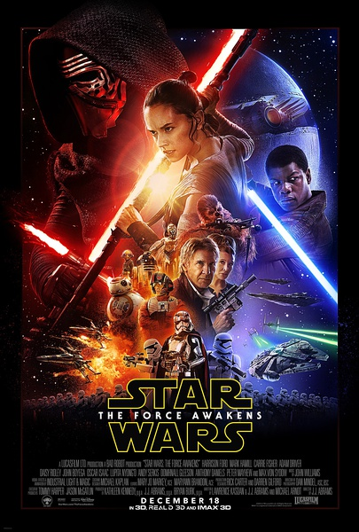
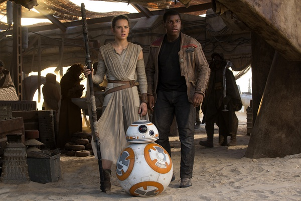
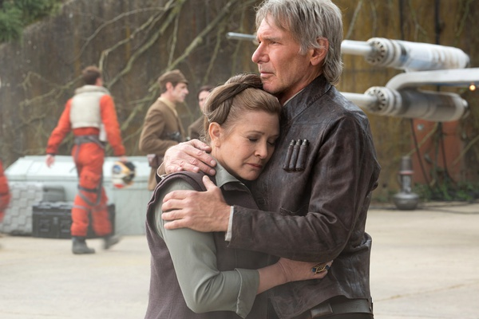

《星球大战：原力觉醒 Star Wars: The Force Awakens》

			

老公的评论：

　　我坦白承认，我本人并不是星战迷，而不迷的原因只有一个：与我同时代的同学、朋友都太迷《星战》了，以致于我的“不迷”都可以成为了一个另类的标签。不是星战迷并不代表我觉得这个系列电影不好看，相反，星战系列电影在当年不但好看，而且是真的把星球大战的概念种植到我这代人的脑子里！

　　《原力觉醒》保持了星战系列的基本架构，但是加入了更多的搞笑元素，我觉得冷幽默在这部电影里表现的很充分。最冷的应该就是那个机器人BB-8了吧，哈哈，我相信谁都想拥有这么一个好玩儿的机器人的。

　　如果，我是说如果，有一天，星战系列能够突破激光剑的设计的话，可能会更进一步……。激光剑是星战系列的标志，但是都这么多年了，是不是也该与时俱进一下？

　　我喜欢看外星题材的科幻影视最重要的一点就是喜欢里面造型各异的外星生物，这部电影这一点做的不错，有不少各种各样的生命体，就冲这一点，就值得我看了！

　　听朋友说有些电影院的工作人员不清楚为什么会有人买票看这部电影，我的第一直觉就是这么说的工作人员应该是比较年轻的，他不知道星战系列电影对70年代出生的国人意味着什么！

老婆的评论：

　　这个好像才是我想象的外星世界，长的多怪异的人都有，只要有需要大家都能和平相处。

　　这是一场侵略和反侵略的战斗，第一秩序代表的是侵略方，他们拥有先进的武器，更多的战士，现在他们缺的就是卢克的星系地图，而这地图正在反抗组织波（奥斯卡·伊萨克饰）的手上。

　　芬恩（约翰·波耶加饰）是第一秩序的战士，当他第一次参与行动，就是要杀很多的人，这让他无法适从，返回到基地，他想要做的事情就是逃跑，当然还得帮一个帮手，那就是被抓回来的波，他们俩终于逃出，而波却消失了。

　　芬恩遇到了蕾伊（黛茜·雷德利饰）和BB8，在被追杀的途中又遇到了千年隼号的主人汉·索罗（哈里森·福特饰）。似乎所有的一切都是为了迎接汉的儿子和蕾伊的那场决斗唤醒了蕾伊的原力。

　　我看最后蕾伊把激光剑送到某人手上，应该又是为了下部留下悬念吧。

　　整部电影，我看的很热闹，也很欢喜，所以，这就是一部很好看的电影。

上映年份　2015							
		
http://blog.sina.com.cn/s/blog_52187ba90102wgyy.html
