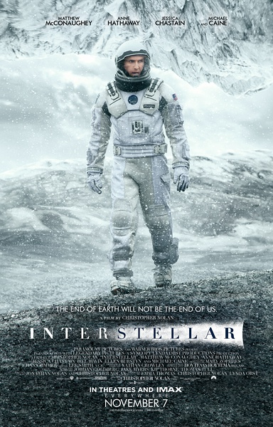
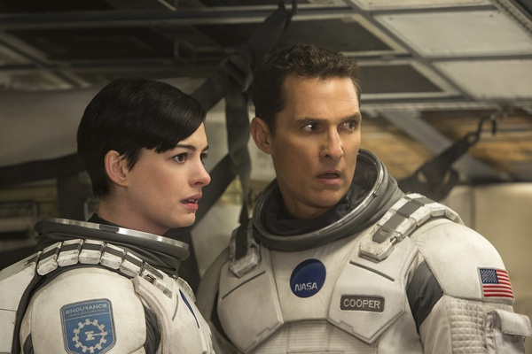
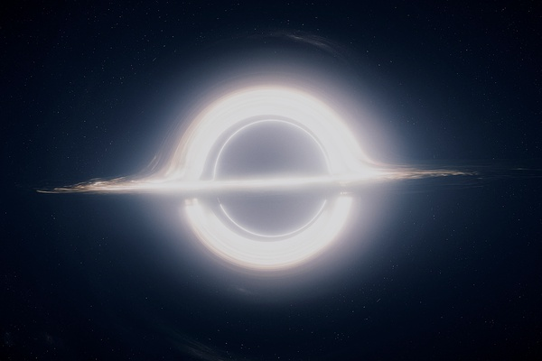

《星际穿越 Interstellar》

			

老公的评论：
 

　　如果是在家里，这部电影很有可能在看了半个小时之后就被我放弃了，因为它的前一个小时真的很没有意思，让我有点想睡的意思，可是因为我发现擅长坐着睡觉的华少都没有睡着，自己也就不好意思睡了。
 

　　因为我是从科幻的角度去看这部电影的，所以有些失望——影片中的虫洞、黑洞、引力、时间与空间……这些概念对于非科幻迷来说可能显得很深奥很吸引人（因为不懂的总是好的），但是这样的题材在科幻影视作品中已经屡见不鲜了——我是说如果单纯地从科幻的角度去欣赏，这部片子的素材称不上劲爆。
 

　　从影片的结构而言，我只是觉得如果能够压缩成一部90分钟的电影，应该会精彩的多。主人公儿子上大学的问题、那个有着巨浪行星的场景、甚至关于曼恩博士的所有内容，在我看来都是和主题无关的，甚至老布兰德博士和女布兰德的关系也是不关主题的，这真的是一种浪费。呵呵，会不会《星际穿越》具有了黑洞强大引力的效应——同样是一部电影，但是外部的时间过得要比一部通常的电影多了60分钟？对了，随着库珀一起上飞船的两个男性宇航员好像也是可以忽略不计的，真的和主题无关。
 
　　不过无论怎么说，这部电影我看完了，虽然是因为在影院的原因，但是肯定还是有值得我记住的地方。
 

　　电影中给我留下第一深刻印象的场景是那个黑人宇航员在飞船上等了那女主人公二十多年！那是一种怎样的寂寞？我一直在想，如果换成是我的话，会不会发疯，这个黑人科学家的内心世界实在是研究心理学应当探讨的话题。
 

　　电影中给我留下的第二印象是导演试图通过视觉角度来表现“在某种维度里时间是有型的”！我觉得那个可以随意选择时间点的“书架后空间”的表现形式是成功的，因为我认为在三维的世界里，有型时间只能表示成这样，要不处于三维世界的我们根本看不懂。
 
　　因为我是个科幻迷，所以影片中那些关于人性的感动场面都被我屏蔽掉了，没什么感触，很遗憾。
 

　　顺便说一下，去电影院看电影是一把双刃剑：效果特别是音效更震撼，这样可以让我更好的观看，但是里面各种奇怪的味道以及旁边的两位胖妹一直在不停打开食品包装袋以及打电话的声音真的让我很反感——要是因为这个理由去寻找另一个类地行星，是不是更科幻一点？

 
老婆的评论：
 

　　这部电影是前奏演的太长，库珀这一家的交代就花了半个多小时，要是不在电影院，我想都看不下去了，除了能体现和女儿墨菲感情深厚外，与整个后来的电影主题有点脱节，或许想演墨菲就因为这个领会了父亲给提示？！
 
　　在飞船里的戏也太多了，觉得有点浪费。
 

　　好吧，我觉得最不好的就是，真正探索星球的戏太少，我想看到更多不同的星球，这些星球有着什么在等待着他们。而真正去的两个星球，一个有很多的水，有大浪，另一个全是冰块，而这都是某科学家自私的不想死在那，骗他们过去的，就因为他差点把人类最后的那点希望都弄没了。
 
　　让我觉得最好的就是，墨菲书房的幽灵其实就是隔着时空的库珀，当时有点惊喜的感觉。
 

　　而关于，虫洞、黑洞、时空扭曲、时间循环、五维空间……等等这些，我只能说我通过这部电影貌似更理解了一点，这也算是一种收获吧。

学好摩斯密码还是真有用哦，不然墨菲如何通过这块表来拯救人类？

                   
来一张科幻点的图片应应景                       
上映年份：2014							
		
http://blog.sina.com.cn/s/blog_52187ba90102vbn9.html
