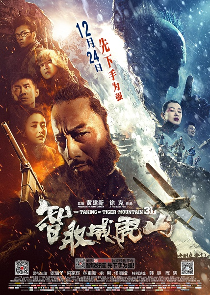
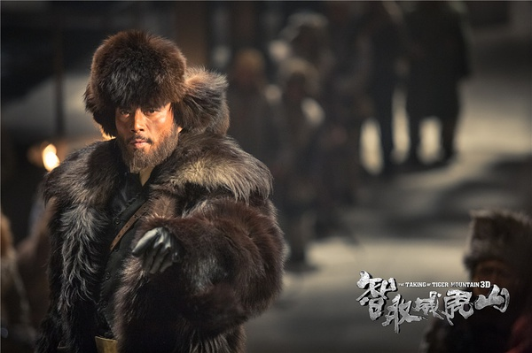

《智取威虎山》

			

老公的评论：

　　一直很怕看国产电影，怕一次次带着希望来，带着失望去。好友闷声色郎向我推荐了《智取威虎山》，说值得看看，我才决定尝试一下。

　　在之前，我对智取威虎山的故事还是很熟悉的，所以进入角色可以比较快，在故事没有什么新意的前提下，我觉得这部电影的拍摄手法还是不错的，至少没让我有一点失望的感觉。

　　不知道是不是我看的版本的问题，电影中对杨子荣被吊起来又被放回来的事情交代的很不清楚，中间的时间差好像有点大，是剪辑的问题吗？不过瑕不掩瑜了！

　　这部电影之中让我觉得最好笑的部分不是“就一个字”，而是看小炉匠栾平，因为杜奕衡怎么看怎么像刘德华，怎么也难想象刘德华会扮演这样一个角色，有趣！

　　看电影的时候，想想我的姥爷还参加过东北剿匪，还是挺有自豪感的，虽然和我本人没有什么关系了。

　　另外我看这部电影的时候还有一个好奇点——坦克怎么开到山里的，挺酷！没有坦克，小分队攻打威虎山是有点夸张的，有了坦克虽然显得容易了，但是我老觉得坦克有点突兀。

　　有一种电影，看的就是酷炫——张涵予版的《智取威虎山》就是这种电影。

老婆的评论：

　　一个字，这部电影还能看。有的情节还挺搞笑的。

　　不过，这些土匪化妆的都有点丑吧，梁家辉演的三哥，真是一点没有梁家辉的影子啊。

　　30多个人搞定那么多的土匪也真是难得啊，张涵予演的杨子荣卧底到威虎山显的就很重要了。

　　这个也应该是科幻片吧，结尾还来了场跨越时空的聚餐，有意思。

　　不管怎么样，我们都要谢谢那些为我们现在安定生活战斗过牺牲了生命的战士们。

　　大概是看内地的影视作品太少，这些演员真没几个熟悉的，在这点上，觉得少了点乐趣。

土匪的形象很夸张

上映年份　2015							
		
http://blog.sina.com.cn/s/blog_52187ba90102w3rw.html
