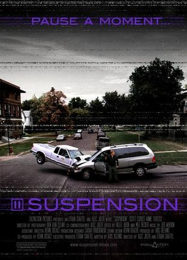

《暂停 Suspension》

			

 
老公的评论
 
　　博友Jayster推荐的电影，看过之后，感觉还不错。
 
　　《暂停》是那种淡淡的电影，如果不是因为结局太过突然，我会对这部电影有更高的评价。
 

　　可能有人会觉得男主人公的行为举止很奇怪，可我觉得不论是男女主人公，都刚刚经历了那样的惨痛经历，心理状态有一些不正常可以理解。
 

　　或许这个故事讲得是人类的动物本能吧，母狼、母熊都有过在为了心理慰藉而养大了人类孩子的经历，男主人公估计也一样，因为车祸失去了妻儿，所以他本能的找一个女人来弥补自己的“家庭感”，更何况这个女人还是和他同病相怜呢！
 
　　还是要说结尾太突然了，感觉上像是编剧编不下去了，为了结尾而结尾似的！
 
　　看这部电影的时候，一直在想，如果我有了暂停时间的特异功能，我会利用他来坐什么呢？嘿嘿！
 
老婆的评论：
 
　　这部电影的感觉很像是听了一个故事，没有大起大落，看完却让人添上淡淡的忧愁。
 

　　男主人公Daniel的行为很是精神创伤后的心理扭曲，他居然爱上了迫害者的另一半，他什么也不想干，在发现他的摄像机对时间有暂停功能后，他一心想去照顾Sarah。看着他去帮Sarah家修理各种东西，去商店为Sarah换新毛衣，这种感情真的很奇怪。最可怕的是，他看见有男老师去Sarah家，居然暂停时间去揍那老师，害的那男老师丢了性命。
 

　　Sarah非疯不可，Daniel所做的一切让Sarah陷入无尽的恐惧中，她和别人说起这些事情时，大家都觉得她有精神问题了。Sarah试图逃出这一切时，Daniel居然用暂停一家一家的旅店找过去，终于把Sarah找到了。
 

　　当一切都清楚时，Sarah又被Daniel绑架了，只是这次Daniel为此陪上了性命。看着Daniel在生命的尽头还一点点移到Sarah后面为她挡着时，真不知道要可怜他还是鄙视他。但这对Sarah来说是一种解脱吧！
 
上映年份
2008							
		
http://blog.sina.com.cn/s/blog_52187ba90100z4st.html
