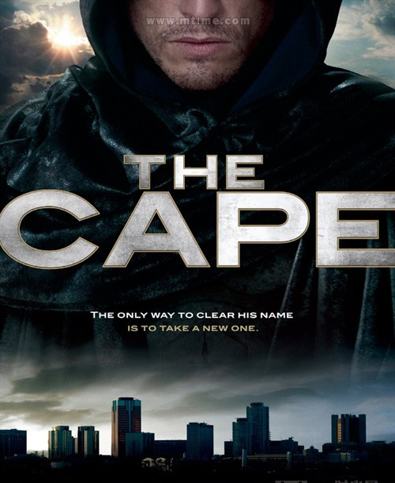

《暗侠 The Cape》

			老公的评论：
 

　　我忘记了是看到第六集还是第七集的时候，我向老婆大人提议放弃这部剧集，一来是因为这部剧集只拍到第十集就被砍了，二来是这部剧集实在是不怎么好看。
 

　　我不知道我是否了解了导演的意图，但在看这部剧集的时候我看不到主线，如果主线是主人公要为自己洗刷冤屈，那么他所作的事情就要围绕这件事情展开，显然故事不是这么构思的。
 

　　比起那些策划的很精巧的美剧来说，是不是因为这部剧集是根据漫画改编的，所以编剧们没有很上心？这部剧集好像什么都沾了一点边儿，罪案、动作、奇幻、高科技，但在哪一部分又都表现的不够彻底，显得有些不伦不类。
 

　　写到这里，想起来了，我们是看到“巫妖王的崛起”这个故事就不再看的，这个故事有两集，但我们只看了第一集，就决定放弃了，呵呵，可怜的暗侠。
 
　　本来，这种剧情是老婆大人比较喜欢的，可惜，这个故事卡通的不够彻底、糟蹋了一个好题材。
 

　　《最后一刻》、《血色月光》、《恐龙帝国》、《谍谍不休》、《时间旅者》……，我们看了很多只拍了一季就喊停的剧集，但这一部，是我们一点都不留恋的。
 

 
老婆的评论：
 
　　这部电视剧拍到十集时叫停了，我和老公看了两集就可以叫停了，期待之后有所不同，看到第六集时，实在不想看了。
 

　　感觉中漫画改编的英雄人物应该更出彩一些，在这部影片中，Vince这个英雄让我相当的纠结，要无数次的就去救最大的坏蛋死对头Peter
Fleming，除了我觉得主人公很变态之外，我想不出什么了……，要塑造的Vince应该是一个英雄，为了自己的名誉而去救Peter
Fleming那就是牺牲很多人的利益成全自己，这是我觉得此片最大的败笔。
 

　　另外，Vince并没有超能力，只是一个普通的警察，虽说有魔术师MAX的训练，但在后来的影片中，他远远的超过这些，我很难想象一个普通人在楼顶上飞来飞去或者说跳来跳去，这是我觉得此片的第二大败笔。
 							
		
http://blog.sina.com.cn/s/blog_52187ba90100vekj.html
