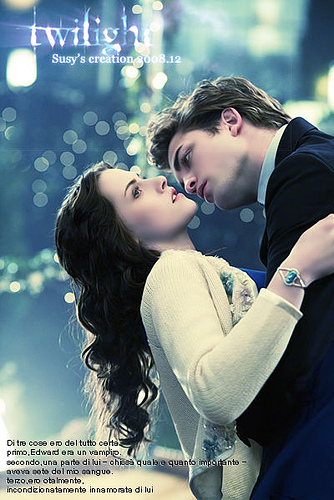
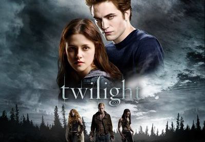
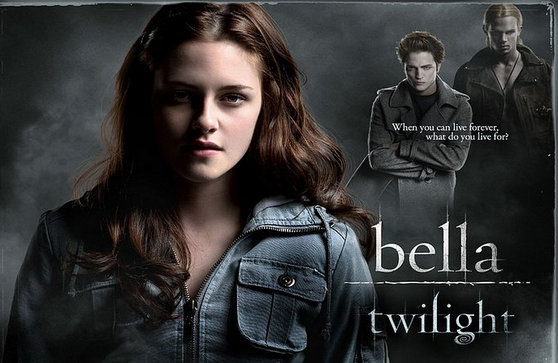

《暮光之城 Twilight》

			【夫妻影评】《暮光之城 Twilight》

老公的评论：
 
　　这部电影是朋友兼徒弟袁景推荐，因为我们一直喜欢吸血鬼的片子，所以就看了。
 

　　家里刚买了大电视，看高清的片源就是非常的爽，稍微有一点遗憾的，是这部电影并不酷，而给人一种淡淡的感觉，真的如同月光一样，笼罩着那么一份淡淡地，醉人的昏黄。
 

　　这种感觉就像是梦的感觉，你觉得每一个场景，每一个表情都是那么真实，但当你想仔细去琢磨的时候，却仿佛总是隔着一层雾，怎么都看不清楚，而且，越用力反而越觉得模糊。
 

　　可能是吸血鬼不敢见阳光吧，不过这部电影里的吸血鬼还好，并不会被照射阳光而毁灭，反而是发出五彩缤纷的光芒，很诡异，很另类，但并不让人觉得意外。
 

　　爱德华的一家给人的感觉很好，很温馨，特别是他们一家子给人给贝拉做饭的那段剧情，真的很温馨。这是为数不多的我看到的关于吸血鬼的温馨。
 

　　老婆大人查过了，这部电影的原著还有四部作品，很可能都被改编成电影，她要看，我也会看的。另外也要抽个时间，买书来看看，想好好重学英语了，没准看原著效果更好！
 

 
老婆的评论：
 
　　对这部影片的感觉是意犹未尽。看完好久我还沉浸在这部影片中，整部影片虽然淡淡的，却不知道怎么的就被故事的情节牵引住了。
 

　　越看吸血鬼的故事，就越喜欢吸血鬼，当然是喜欢像卡拉家族的素食吸血鬼。他们与以往我看过的吸血鬼不同，他们不怕阳光，阳光不会把他们烧死，只是让人看起来不同而已，钻石的光芒。
 

　　我喜欢爱德华和贝拉讲的那个羊和狮子相爱的故事，说自己就是那头受虐的狮子。喜欢电影中爱德华要带贝拉回家而卡拉家族为了贝拉一起在厨房做饭的情节，多么温馨多么有人情味，吸血鬼不再是那么的残忍和无情，喜欢爱德华带着贝拉跳往大树上谈情说爱的情节，让人多少向往，我想贝拉再也接受不了其他的人了。
 

　　有的时候想17岁那年，要是我也遇到吸血鬼就好了，再也不会老了，是一个吸血的怪物吗？其实吸血和吃肉并没有区别，毕竟世界上的动物还是挺多的。而17岁那年的贝拉也遇到了吸血鬼，注定了她一生的不平常。
 

　　看完这部电影后，我忍不住的想知道以后怎么样？结果是我希望的那样，经历重重困难的贝拉与爱德华结婚生子了，而雅各布也被证明是狼人，真好！我准备把这部小说找来看看，这是我第一次有看完电影后要找原著来看的冲动。
 
上映年份 2008
 
部分演员职员表
Drector……Catherine
Hardwicke

Writer……Melissa Rosenberg
Writer……Stephenie Meyer（Novel）
 

Bella……Kristen Stewart
贝拉……克里斯滕·斯特瓦特

Edward……Robert Pattinson
爱德华……罗伯特·帕丁森							
		
http://blog.sina.com.cn/s/blog_52187ba90100hbil.html
