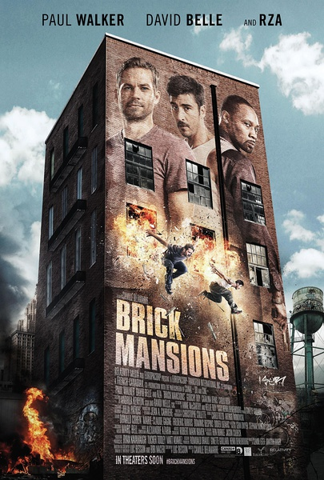
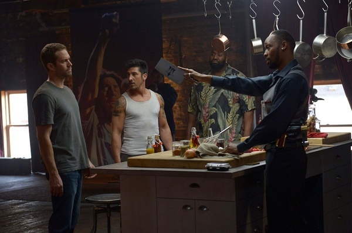
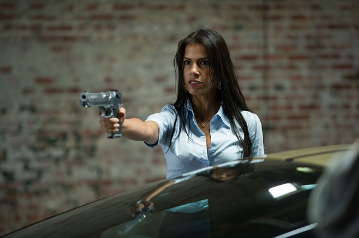
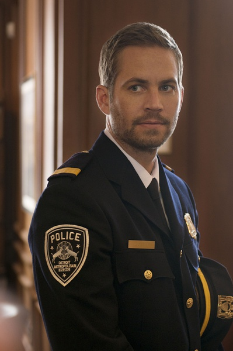

《暴力街区 Brick Mansions》

			

 
老公的评论：
 
　　身边的朋友一直不停地向我推荐这个系列的电影，如今终于看了保罗·沃克版本，除了缅怀这位帅哥之外，觉得电影确实精彩刺激。
 

　　对于不好看的电影，我们是不会看完的，所以我一直觉得一部片子能被我们看完一定有它的道理，也就是说我们在看电影的时候必须明白我们为什么看这部电影。
 

　　我确信我们看《暴力街区》绝对不是为了看外星人，不是为了看手撕日本鬼子，也不是为了看一个严谨的罪案剧情，看的，就是耍酷——飞车、跑酷、打斗，这才有意思。
 

　　很可笑的是一些所谓的影评说这部电影除了沃克卖帅和一些跑酷之外没什么看点，如果这个逻辑成立的话，那么我们是不是也可以说《阿凡达》除了特效之外没什么看点，《泰囧》除了搞笑没什么看点呢？最看不起的就是那些为了显示自己高人一等而随意否定的嘴脸。
 
　　我是一个没看过《暴力街区》其他前作的人，我觉得《暴力街区》作为爆米花电影，绝对可看！

　　
老婆的评论：
 

　　把一些有问题或者贫穷的人放在一个街区，没有学校没有医院就让这些人自生自灭，呵呵，如果这样能解决问题的话，社会发展早就不一样了吧，这可能是一个理想的世界，可是大家都是生活条件好的人，那这些服务业谁来？
 

　　利诺是在这个街区生活，他因为抢大毒枭特里梅因他们的毒品得罪这些人，又因杀腐败的警员而落狱，还要回街区救前女友，同时达米安警员被派到这个街区来寻找丢失的武器也要为他的父亲报仇，这两个毫无关系的人，就这样交集在一起。
 

　　事实证明坏人没有想象的坏，大毒枭想着让达米安来拆了炸弹就好，好人没有想象的好，市长为了自身的利益，要炸了这个街区。同时达米安爸爸死的真相也是因为市长嫁祸给大毒枭。
 
　　当街区的人占领了市政办公楼……，让人感觉还挺爽的。

这位女友非常的彪悍啊！

很遗憾保罗·沃克意外去世！！

上映年份 2014							
		
http://blog.sina.com.cn/s/blog_52187ba90102v7w8.html
