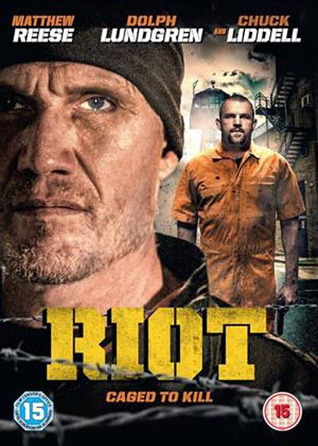
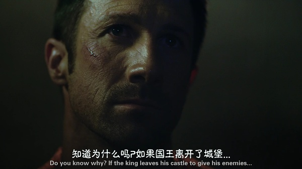

《暴动 Riot》

			

老公的评论：

　　这是一部没有所谓大场面的电影，但是故事整体让我觉得还挺不错的。虽然复仇是故事的主线，但是在复仇的同时也有伸张正义的成分包含于其中。

　　这部片子让我记住的马修·里斯，感觉他虽然不是很高大的那种动作明星，但是扮相很酷。在这部电影之中，虽然那些配角们有些打斗显得很假，但是主角们的打斗场面还是很有可看性的。

　　杜夫·朗格真的是老了，不过块头还在，他挥枪的那几下子真的像是一只大熊在对付人类，那些监狱狱警在他面前显得太瘦小了。

　　电影中女子打斗的桥段安排的并不是很完美，观赏性并不高，而且我不明白那个卧底女警为什么要回去打斗……

　　女记者的朋友变成了一个杀手，这个设计虽然突然，但是也有些突兀——并不是谁都能很容易地变成一个杀手的，这么好的朋友，女记者居然不知道对方的真实状况，观察力……

　　这应该不是一个大制作的电影，可看，虽然有回忆的情节，但是不破坏故事的节奏感和完整性。

老婆的评论：

　　我觉得像这种动作片，不要再剧情上去寻找追求，不过，主人公杰克的性格我非常的喜欢，复仇那个干净利索，是不是原本进这所监狱也是特意的？那还能附带把黑警搭档给杀了。

　　杰克为了对付黑警或者已经腐败的体系，先同人去银行抢劫，把证据给了记者，很厉害。

　　在监狱里一次次的肉搏，没有好的体能和本领，我估计杰克活不到最后的。另外，杜夫朗格扮演的FBI，最后成全了他去杀了最大的坏蛋，看着比较解气。

上映年份：2016							
		
http://blog.sina.com.cn/s/blog_52187ba90102x0s7.html
