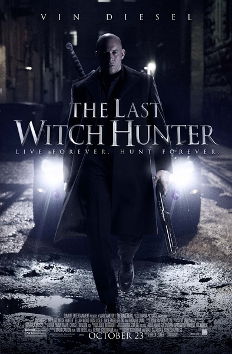
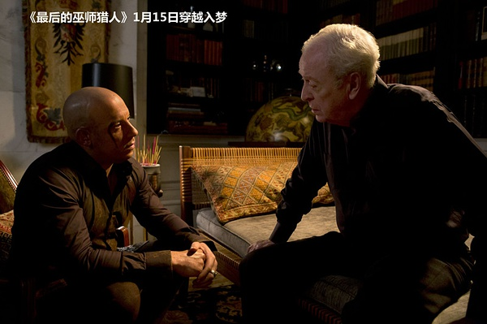
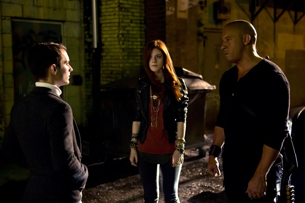

《最后的巫师猎人 The Last Witch Hunter》

			

老公的评论：

　　从《星际传奇》认识的范·迪塞尔，从《极限特工》开始喜欢上了这个说话瓮声瓮气的大块头，范·迪塞尔最近几部戏显得有一些老态了，但是在他之前的电影里，大块头的他总是能表现出一种酷酷的冷幽默。

　　灵异题材总是让我们非常喜欢，被诅咒不死之身又是我们非常喜欢去探究的题材，不管白魔法、黑魔法也都是有足够的吸引力，所以，在爱看的大前提下，这部《最后的巫师猎人》情节紧凑，让我们两个很开心的从头看到尾。

　　剧中，卡尔德没有刺下毁灭巫后心脏的那一剑，为变化以及续集埋下了伏笔，但是，卡尔德为什么要做这样的选择呢？看过很多有关被诅咒的不死之身的影视作品，大多数主人公都是很痛恨自己的不死之身，很希望能做一个正常的人，这部电影在这一点上算是反主流吧，卡尔德好像很接受自己的状态，或者是一种无可无不可的心情，挺好。作为一个凡人，我真的想有不死之身，那样我就有足够的时间来读书学习了。

　　写上面这段话的时候，突然想到，如果世界上真的有巫师，女巫，看到这部电影会怎么想呢？

老婆的评论：

　　这是我最近让我看的很高兴的电影，所以，我很喜欢这部电影。

　　库尔德（范·迪塞尔饰）是一个被诅咒的人，因此他活了800多年了，他的一生都在致力于女巫族的斗争，多兰族一直是他的助手，现在到了第37代多兰（伊利亚·伍德饰）。在36代（迈克尔·凯恩饰）多兰退休当天被魔法控制，为了找到真凶，库尔德找到女巫克洛伊（露丝·莱斯利饰）。

　　在故事里，黑魔法通常代表的是邪恶，所以，无论如何，正义一方的库尔德必会赢得最终的胜利，而这里的黑巫后也的确是邪恶，她的一切作为只是为了毁灭人类，而且还能复活，真是打不死的小强，最后她的心脏又被留下来了，故事仍会继续。

　　怎么也没想到第37代多兰是坏人，看着那么诚恳。

　　库尔德和克洛伊将会如何生活？还真让人期待。

上映年份　2015							
		
http://blog.sina.com.cn/s/blog_52187ba90102wf0c.html
