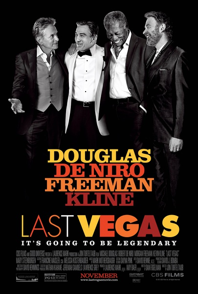
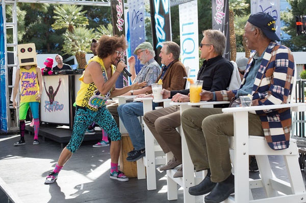
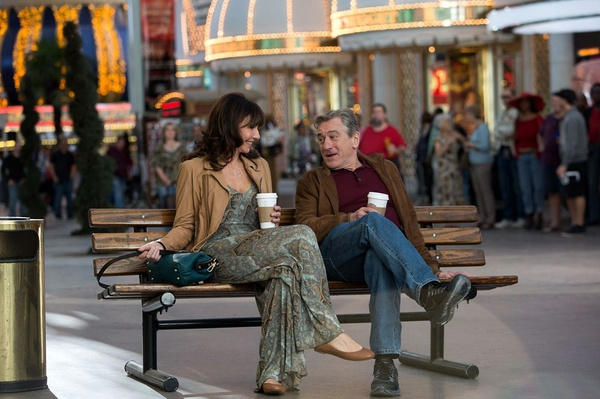

《最后的维加斯 Last Vegas》

			

老公的评论：
 

　　弗里曼、德尼罗还是比较熟悉的，道格拉斯看着很眼熟，也知道看过很多他的作品，不过却叫不上名字，至于另一位主人公，直到看完这部片子，查完资料，我还是把他的名字给忘记了。
 
　　对于平均年龄超过了七十岁的四位老男孩的故事，除了温馨，带给我们的还是温馨。
 

　　说温馨，并不是指那些虚情假意的矫揉造作，而是说，如果我到了七十岁，如果能够像电影里的主人公那样的心态、那样的生活，我会是很满意、很知足的。
 

　　《最后的维加斯》有友情、有爱情、有亲情、有幽默……，好像现在的西方电影流行怀旧，但是这种温情怀旧比起史泰龙、阿诺、威利斯……来说，又是一种截然不同的感觉。
 
　　看这部电影，让我觉得人活于世，应该放开怀抱，虽然不能说是肆意妄为，但是如果可以在适当的情况下疯狂一下，应该会更开心。

老婆的评论：
 
　　没想到这部电影很好看，非常的温馨。
 
　　看完后一直在想我70岁左右会是怎么样的？真不敢想！我想我很难有他们这样的决定吧，顾虑太多。
　　这四个小时候的好朋友都老了，每个人都过着自己的生活，孤僻又神神叨叨的老头、生病被孩子管着
的老头、正在和一堆老头老太太锻炼身体的老头、还有一个事业成功有钱要娶一个比自己小很多的老头，
因为他，大家决定去拉斯维加斯开单身Patty。
 
　　见上面了，虽然还因为一些过去的事情吵吵闹闹，四个老头在拉斯维加斯度过了非常快乐的几天，赌
钱赢了，给美人比赛当裁判，开大场面的Patty，被认为是黑社会大佬，富老头和倔老头都爱上拉斯维加
斯一个唱歌的老太太……
 
　　由此看的出来，什么时候都可以保持快乐的，只要你去做去感受！
 
　　这四个演员很有味道。

上映年份　2013							
		
http://blog.sina.com.cn/s/blog_52187ba90101fvre.html
