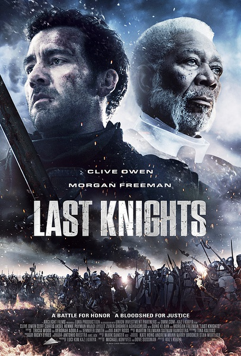
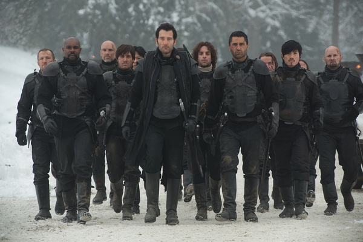
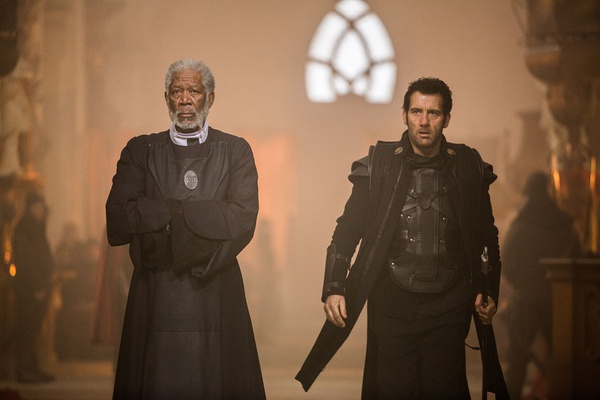

《最后的骑士 Last Knights》

			

老公的评论：

　　最后到底是什么意思呢？是克里夫·欧文饰演的雷顿准备反抗吗？

　　之前和朋友一起聊天的时候刚好谈到了有关西方文化的问题：有钱人是有钱人，贵族是贵族。——西方的文明不像我们这么民主：皇帝轮流做，明年到我家——西方的王族是和血统有关的，即使你推翻了一个皇帝，你自己也不能当皇帝，因为你的身份烙印在很多代之前就已经被打好了。

　　我不明白巴和雷顿为什么丝毫都不在乎用“死亡”去证明什么——这么死毫无意义，既然雷顿最后还是要复仇、还是要反抗，为什么不在一开始就用武力来证明一切呢？

　　其实我更佩服的是这部电影的编剧和导演，雷顿佯装自暴自弃密谋复仇的感觉其实很难在这么短的篇幅里描述清楚的，但是电影表现的不错，至少在雷顿放任巴托的女儿被卖去当妓女之前我都认为没有任何破绽，这点让故事增加了一些悬念。

　　其实，电影的结果总是可以事先预知的，所以看电影主要看的就是过程，《最后的骑士》过程不错，而且电影架空的背景也选的不错！

　　不过，对这部电影的评价多少有些不客观吧，因为我们还是很喜欢克里夫·欧文的！

老婆的评论：

　　看了很久才看出来指挥官雷顿是克里夫·欧文演的，他比之前显得憔悴和老了，岁月真的不饶人。

　　在我看来本片的君主巴托（摩根·弗里曼饰）为了少挑战腐败权利也同时为了他的尊严，就这样与摄政王对上，最后英勇就义，还让雷顿背上一个心理包袱，导致他们巴托城的人都流放，真的很欠抽，当然，对于他来说，这一切都是值得的。

　　雷顿和颓废的在喝酒在泡妞，和曾经的队友吵架，把君主之剑当掉喝酒，把妻子气走，不救曾经的巴托之女，摄政王终于被迷惑了，不再派人跟踪他。雷顿的那一瞬间就变了气质。

　　终于要复仇了，原来这些人一直都在为复仇做准备，看这么多的人忽然冒出来，慢慢的不停的有人牺牲。

　　最后那一段，雷顿是死了还是没死？

上映年份 2015							
		
http://blog.sina.com.cn/s/blog_52187ba90102wrzr.html
