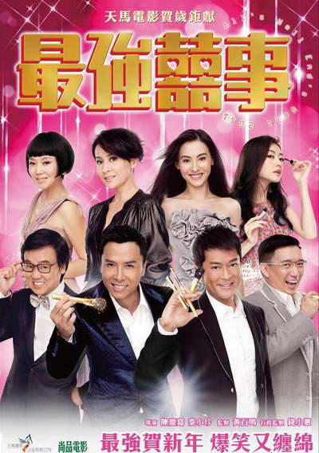

《最强喜事》

			【夫妻影评】《最强喜事》

老公的评论：
 
　　这部港产喜剧看起来多少有些和以往的作品不一样，所以断定它应该不属于“家有喜事”系列中的一部。
 

　　作为一部可以给人带来笑声的喜剧，我觉得这部电影还算是可以及格的，在整个观看的过程中，我觉得最让我记忆深刻的是：当叶问遇到张加玲——感觉甄子丹虽然拍过很多的功夫作品，但在他以后的日子当中，再也无法摆脱叶问的形象了。儒雅之中带有一身傲骨——这是其他明星不曾塑造过的形象。这个搞笑的复古片段让我觉得很符合大众的心理。
 

　　曾华倩的出场让我有些意外，不得不再称赞他一次——美女就是美女，不知道她和刘嘉玲这两个情敌再一起有没有关于梁朝伟的话题可聊；杜汶泽演这种富家子弟还不错，看来他有望成为新一代的“港片配角第一人”了；刘嘉玲保持了自己一贯的风格，因为喜欢梁朝伟而喜欢刘嘉玲，看到她的感觉依然不错；张柏芝好像有些显老了，感觉上不再适合演这样清纯的角色了，不知道导演为什么挑上她而并非一些更“新人类”的女星；黄百鸣相比去年的贺岁喜剧，年轻了不少，不知道是不是减肥的功效，看来我也要减分了！闫妮在这部戏里，并没有什么出彩的地方，而且她的扮相和港星的风格不一样，总觉得有被比下去了的感觉。
 

　　最后说说古天乐，挺难为他的，去演一个假娘娘腔，不过又和现实里的情形很相同——做女性生意的男性总要带些娘娘腔才好——可剧中甄子丹扮演的角色就很男人啊……
 
　　可看的一部电影，但却没有什么可以让人记忆很久的台词与桥段。
 
老婆的评论：
 
　　这部电影的明星真多，可惜剧情衔接的差点意思。
 

　　很出乎我的意料，古天乐竟然演了一个娘娘腔，演的还真不错，而甄子丹演了一个化妆师，不需要展示他的功夫了。看网友评论说这是甄子丹在拓宽戏路，我想也是一个不错的开始吧，但怎么看还是他演功夫片更酷。曾华倩和刘嘉玲在一部戏中出现，这还真没想到，当年的好姐妹因为梁朝伟闹翻了，也不知道她们现在一笑泯恩仇了。闫妮在这部影片的角色，我觉得不是很适合她。张柏芝的表现也中规中矩的，杜汶泽的扮女人给人印象挺深刻的，黄百鸣老了，熊黛林配杜汶泽显得太高了。
 

　　可能是出演的明星太多了，所以每个人物刻画的不是那么深刻。这样相对来说古天乐的娘娘腔就有特点了，我只是有点不能接受为什么男的当化妆师就一定要娘娘腔？这样甄子丹的这个化妆师就不错了，那段一下化十几个人的场景，还是蛮有意思的。
 

　　这样的影片要是你没什么事情可做事时，抱着一堆零食，窝在沙发里，他也可以陪你度过快乐的一个多小时，里面有一些经典的场景和台词能让你乐呵乐呵。
 
上映年份
2011							
		
http://blog.sina.com.cn/s/blog_52187ba90100q5zr.html
