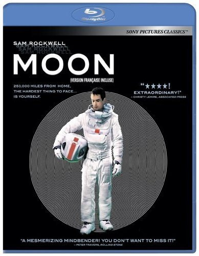
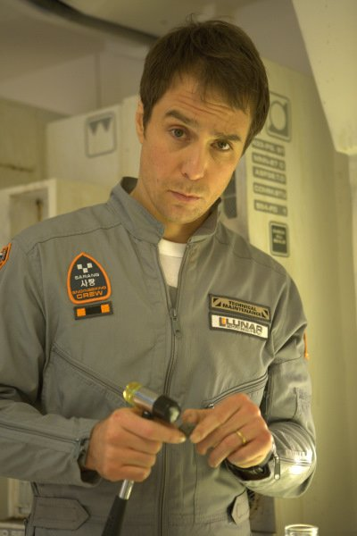

《月球 Moon》

			【夫妻影评】《月球 Moon》

老公的评论：
 
　　对于只有一位演员拍摄的电影，很难说它好看。
 
　　这个演员不但扮演克隆后的自己，还扮演两个克隆后的自己，你觉得有意思吗？
 

　　关于克隆人权益的题材，是个值得拍摄的题材，相信也会有很多可以碰撞的火花出来，比如《逃出克隆岛》就很不错，但《月球》，我不觉得这样的内容有必要拍成一部电影。
 

　　从某些意义上来说，这部电影和《阿凡达》有点像，那个像是外星版的美国人打印第安人，这部则像是月球版农奴寻求解放，真的不觉得这样的题材被拍成电影有什么好的。
 

　　知道故事在讲什么，知道导演的意图是什么，但不知道导演拍一个这样的故事除了满足个人虚荣还要做什么，真可怕，不论是对我这样的观众还是导演，都是挺可怕的事情……
 
老婆的评论：
 
　　这是迄今为止我看过的演员最少的电影，一个人演员。比上次看《足迹》时还震惊。
 

　　如果不去想电影的更深的意义的话，比如关于克隆人，关于人类去挖采月球资源以及关于欺骗之类的问题的话，我对这部影片提不起一点精神，就这么一个可怜的演员在一个机仓中抓狂，自言自语，及愚蠢的等待三年合同完成回归地球，当另一个自己出现在眼前时，才有那么点生机，故事才好看一些。
 

　　在这部影片中，我对那个机器人倒是感觉不错，很智能，当山姆与他说，这是咱们俩之间的秘密时，机器人表现的很讲义气，这一点影像深刻。在最后其中的一个克隆山姆在机器人的帮助下，回到了地球，把月能公司的阴谋揭穿了，这一点电影中只用很淡的手法就带过了，却让这部影片升华了。
 
上映年份 2009
 
导演
Duncan Jones
 
编剧
Duncan Jones
Nathan Parker
 
主演

Sam……Sam Rockwell
萨姆……萨姆·罗克韦尔							
		
http://blog.sina.com.cn/s/blog_52187ba90100hbin.html
