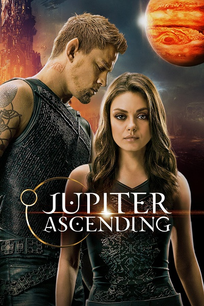
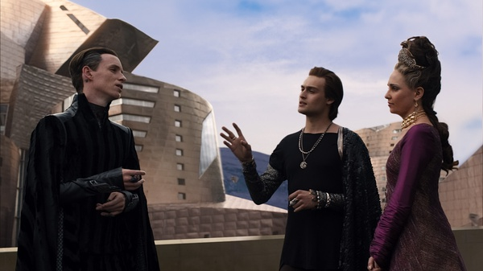

《木星上行 Jupiter Ascending》

			

老公的评论：

　　冲这部片子名字翻译的这么不通顺，本来是要放弃的，后来看了一些片花儿，感觉还不错，才决定看的。

　　高科技与野蛮的整合总是显得很另类的，这部电影就是这样，一方面什么什么都可以隐形，另一方面却还采用这王权的管理制度，还转世……，这种矛盾造就了这部电影的世界观，不过好在逻辑还算圆，看起来没有什么看不下去的硬伤。

　　其实我们还是挺喜欢主演查宁·塔图姆的，看他演电影觉得有意思是因为《龙虎少年队》还有一部好像叫《白宫沦陷》的片子（有一个题材完全相同的，是巴特勒主演的，名字搞不清楚了），整体来说，塔图姆有型，动作片对他来说很适合。

　　故事中说女主角成为女王的原因是基因重组的巧合，这让我想起了，让一堆猴子敲击键盘，多久才能产生出莎士比亚的名著的一个假说，挺有意思，挺有想法的。

　　我觉得主人公的靴子比翅膀好用啊，为什么还要装个翅膀呢？还要自己费力气……

　　能飞真的很酷！

老婆的评论：

　　想象一下，这个世界有很多很多颗与地球一样的行星，那些行星上是不是有和我们一样的人类，或者其它的更高级的外星人再或者有比我们更低级的外星人。各自正在发展着，高级的外星人有能力去探索其它的星球，而低级的也正在努力的进步着，就这点而言，我不再排斥地球上科技的进步，虽然这种进步说不定会导致地球的灭亡。

　　回到这部电影，刚开始的时候，各种线条，感觉不到主线到底是什么，或者说电影到底要倾诉什么？我想最后只能归结成这是一部带着科幻色彩的爱情片，转世女王朱庇特和赏金猎人凯恩的爱情故事。

　　其实这部电影给了我一些新的东西，比如，他们造了一个地球的主人，很有意思，也许真的存在呢。假如存在，那应该是比地球更高级的文明了吧，我想不管多高级的文明，只要是有人就会有欲望，比如那两个领主，为了得到地球，一个用阴谋，一个用威胁。

　　地球上一个叫朱庇特的女孩，是一个清洁工，她为了一架望远镜还得去卖卵子，谁知道她竟然是地球的主宰者女王呢？我要感叹一下，这些人动不动就能活个上万年，再转世，岂不是真正的千秋万代了。

　　还有这部电影有很多高科技的东西，很酷很炫，如凯恩的鞋子，盾牌及那些外星小飞船，和那战斗的场面很有大片的感觉。

　　整体上这部电影我觉得很好看的。

又遇到了

上映年份 2015							
		
http://blog.sina.com.cn/s/blog_52187ba90102vpow.html
