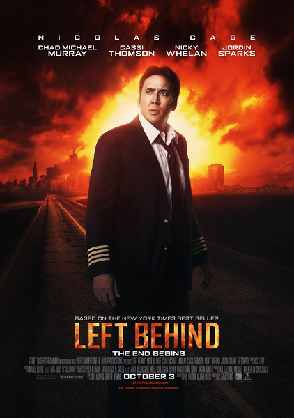

《末日迷踪 Left Behind》

			

老公的评论：

　　很多地方把这部电影归类于科幻、惊悚，我觉得真不是这么回事儿。这部电影不能算是惊悚，也不是科幻。

　　对于电影中一些人，特别是儿童为什么消失，导演并没有给出一个准确的说法，而是用剧中人物的猜测来代替答案，这是一种好的擦边球的手法，但似乎并不能完全地自圆其说。

　　说起来，这部电影更像是一部灾难片，主人公机长在女儿的帮助下成功地迫降了飞机，拯救了飞机上的乘客，大概剧情就是这样。而其他剧中人物，比如那个记者，我真不知道他的出现意义何在。

　　我是冲着凯奇和科幻的概念看这部电影的，但是直到结束，都有一些莫名其妙。不过，电影的可取之处却是让我从另一个角度看到了美国人如何看待上帝与基督文化，也算是了解他国国情的一种方式吧。

　　虽然我们看完了这部电影，但是我保守地向大家推荐《末日迷踪》——能够获得第35届金酸梅奖“最差影片”、“最差男主角”、“最差剧本”三项提名，肯定是有他的原因的。

老婆的评论：

　　这两天看的这部和《罪恶之城2》两部电影实在让我很失望！

　　这是科幻片？就算是关于基督教的影片，那应该是加上了科幻的色彩，要不那些消失的人去哪里？

　　我死后是去了天堂？去天上还是去天堂都无所谓，重要的是那个地方一定要有蜂蜜！

　　尼古拉斯凯奇，怎么接了一部这样的电影呢？！

上映年份　2014							
		
http://blog.sina.com.cn/s/blog_52187ba90102vic5.html
