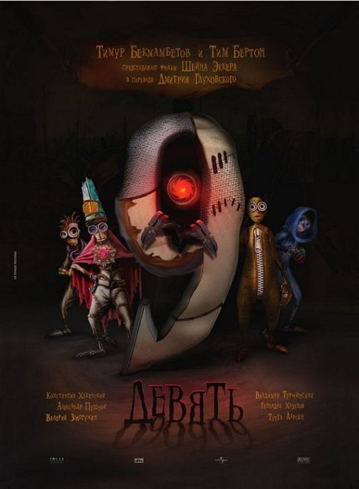
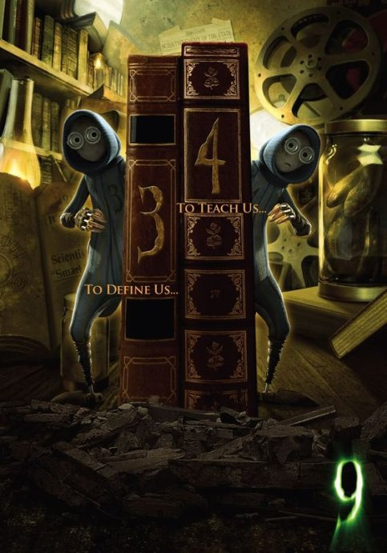

《机器人9号 9》

			【夫妻影评】《机器人9号 9》

 
老公的评论：
 
　　侄女来看过这个片子的片头，她觉得那个小机器人很恐怖，我基本同意这个观点。
 
　　相对奇怪的一点，是老婆大人觉得这片子还不错，还可看，我不大认同她的观点，尽管她是老婆“大人”。
 

　　首先，我不喜欢这个片子的画风，我到没觉得恐怖，但是觉得里面的造型多少有一些恶心。搞不懂的概念是——本来动画片就是应该用来体现真人体现不出的“唯美”的，结果是这样的造型，不仅不唯美，还很丑陋。
 
　　其次，我觉得故事的主人公不够突出，没看明白为什么是“9号”。
 

　　再次，我觉得编剧有点自身矛盾的——那个博士制造9号的目的“消灭”那个大怪物，可他却把启动打怪物的钥匙交给了9号，如果他直接销毁那个钥匙呢？……真的看不懂了。
 
　　最后，我不想那些小机器人死亡，最后那些灵魂要是都还给他们多好啊，可惜没有，唉……
 

　　事实上在很久以前就在移动媒体上看到了这部动画片的介绍，隔了这么久才看，一是因为之前看的连续剧太多，另外也因为我们觉得动画片没那么好看了。
 
　　看这部动画片的造型和场景设计，有一种很另类的感觉，也许是美版宫崎骏设计的吧……
 

老婆的评论：
 

　　这是一部适合成人看的动画片。讲的是科技发展后，人类与机器战争到最后，只能下这几个小机器人和一个大怪物斗智斗勇的故事。谁才是最后的赢家？
 
　　整部影片的风格是黑色的，看起来像世界将要被毁灭似地。这样的画面，要是其他时候我是不太喜欢的，在本片我觉得还行。
 

　　机器人9号是本片的主人公，他的苏醒既开启了大怪物，又是大怪物的终结者，他在本片中表现的相当勇敢，就那么一个小不点，居然敢带着其他的小机器人去挑战这么一个大怪物。
 
　　个人觉得这部影片还行，能看！							
		
http://blog.sina.com.cn/s/blog_52187ba90100kgvx.html
