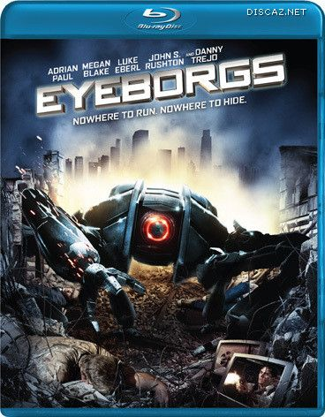
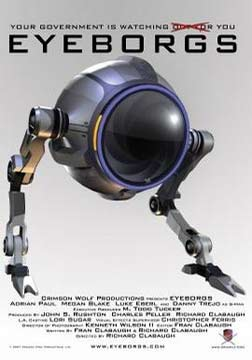

《机器的叛变 Eyeborgs》

			【夫妻影评】《机器的叛变 Eyeborgs》

老公的评论：
 
　　我觉得这部电影的另一个翻译名字《眼球战机》更贴切一些。
 

　　老婆大人觉得电影中的那种最小型的眼球战机非常可爱，其可爱程度直追影视作品中我们觉得最可爱的形象“二齿兽（远古入侵）”，我虽然不是十分认同，但迫于强权，也没敢多说什么。
 

　　这部电影的大的框架，和我们之前看过的《鹰眼》有一些像，都是说人类部署的摄像头发过来开始征服人类的故事，不过差别还是挺大的。
 

　　《机器的叛变》中，眼球战机们不仅监视人们，惩戒违法者，最可怕的一点是居然伪造各种欺骗人的视频图像，太让人震惊了。当我看到美国总统竞选的现场空无一人，所有在电视上播出的节目都是摄像机们自己制作的时候，我真的很佩服编剧的思路。
 

　　本片的结尾也很合情理，不是那种大团圆的结局，但符合影片中的环境，而留下的悬念还真让我思考了一下——如果世界真的这样了，我该怎么办呢……
 

老婆的评论：
 

　　这部影片有点像《鹰眼》，但这些摄像头比鹰眼更厉害，他可以主动去袭击人类，并且设计人类，弄出一个假总统来，实在是一件可怕的事情，可机器真能这样吗？这也许只有科幻影片里才有这种场景。
 

　　看这部影片，让人想到现实社会，很多场所摄像头越来越多，就连我们办公室的门口也装上一个，在我看来并没有什么不好的，对小偷来说，那无疑是增加了他们偷东西的难度。绝对的增加了办公室的安全系数。对于普通人来说，这个摄像头也绝不是一种威胁，有没有摄像头还不是这么活着。
 

　　这部电影，我觉得还能看，看看这些摄像头如何设计人类，伪造摄像记录，如何导演一场没有人的竞选。其实电影的开始，国家安全局抓住一人，他们看到的证据是，这人杀了店主。这人说不是你看见的，是他们看见的。当时我还不是很明白，后来才知道其中的区别。这一次该让人反思了，在证据面前应该相信谁？人或摄像头？
 
　　我不喜欢的是直到电影的结尾，你也不知道人与摄像头之战究竟谁会是最后的赢家？至少我觉得最后的胜利应该掌握在人类的手里。

　　
上映年份
2009
 
主演Gunner……Adrian
Paul
冈纳尔……阿德里安·保罗
欢迎加入我们的科幻俱乐部 <a href="http://tieba.baidu.com/club/10570395">http://tieba.baidu.com/club/10570395</a>，希望我们能够一起科幻！							
		
http://blog.sina.com.cn/s/blog_52187ba90100nntc.html
