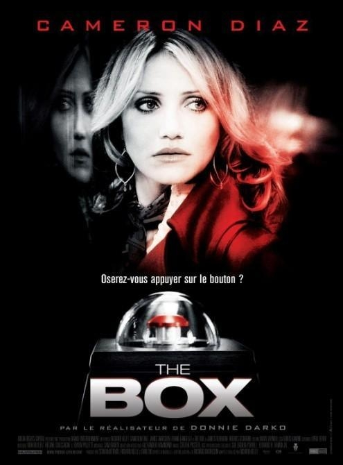
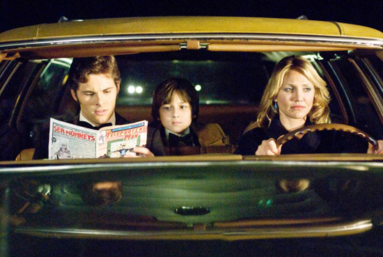
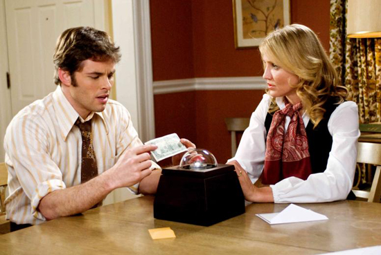

《杀人宝盒 The Box》

			【夫妻影评】《杀人宝盒 The Box》

老公的评论：
 

　　从很多的场景来说，《杀人宝盒》更像是一部生活剧，加入了一些科幻的元素，并没有让这部电影很“科幻”，如果说到悬疑或者恐怖，也没有什么好说的，或者是那个外星工作人员的脸有点吧，但是也一般。
 
　　我觉得这个电影，可能百分之九十九的部分都谈不上好看，但就是他那好看的百分之一，让这部电影整体有趣了起来。
 

　　如果你看这部电影的时候，在开始，和主人公夫妇换个位置的话，你会按下那个按钮吗？如果是在电影结束，你知道后果是怎样的，你还会按下那个按钮吗？
 

　　这个电影的剧情，我和老婆看过之后问过很多朋友，答案当然是怎样的都有，不过，这个电影留下的关于考验人性的话题，却会让我记住很久很久，不是因为这样活着那样的答案，而是当我们有机会做这样的面对的时候，我们的心情会是怎样的。
 

 
老婆的评论：
 

　　这部电影告诉我们，对于意外财富的诱惑一定要小心，这可能是一个大大的陷阱，就如本片，本来是一个幸福的家庭，女主人在100万美元的诱惑下，竟然按下那个盒子的按钮，这一按会导致其他一人死亡，她家也因此搭上两条人命，实在不值得。
 

　　看电影的时候，我和老公讨论这个事情，如果有人给我盒子，要我做出选择，在不知道我和老公要死的情况下，我会怎么样？其实，我也未必能做到一点都不心动，肯定会犹豫，但如果老公说不要按的话，我想我会听的。
 
　　其实这种电影并不是很精彩，但却会让人发人深省，面对生活中的种种选择，是不是都能做到不后悔。

上映年份 2009
 
导演
Richard Kelly
 
原著
Richard Matheson
 
编剧
Richard Kelly
 
主演

Norma……Cameron Diaz
诺玛……卡梅隆·迪亚兹
Arthur……James Marsden
阿瑟……詹姆斯·马斯登							
		
http://blog.sina.com.cn/s/blog_52187ba90100hbir.html
