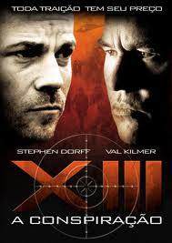

《杀手13》

			【夫妻影评】《杀手13》

老公的评论：
 

　　刚开始看的时候，没觉得这是一部好看的电影，在主人公13号被那两个老人家救到的时候，我甚至怀疑这将是一部伦理片，几乎睡着。
 

　　随着剧情的推移，故事的情节开始有趣了起来，我并没有玩过电影同名的游戏，也不了解整个故事的背景，但电影给我的感觉是剧情很紧凑，虽然有些情节处理的还不是那么完美，还需要一些前后的搭配，但是，真的觉得这部电影可看。
 
　　直到影片结束，我才发现这是一部如此之长的电影，居然不知不觉就过去了三个小时，厉害。
 

　　关于这种情节紧凑的悬疑动作片，我的风格还是不谈太多的剧情，有兴趣的朋友可以自己去看，我想说的是这部电影的结尾，再最后，编剧和导演给我们留下了一个硕大无比的悬念，到底13号想怎么做？他回到美国之后又会发生什么事情？之前出现过的角色，谁是忠，谁是奸？如果拍摄续集的话，主人公可以信任的是谁？他和那个照片冲印店的女老板会不会有爱情故事发生……
 
　　不用说太多，热切地盼望着这部电影的续集！

老婆的评论：
 

　　很久没看过一部时间这么长的电影了，3个小时，哇！还好影片后期比较精彩，不然真的可能熬不住了。就3个时间，结局的安排不是那种交代的特清楚，留下了悬念，13号有没有回去杀现在的总统？总统是否是1号？将军到底是哪个帮派的？太多让人想象的空间了，只好让老公去网上查有没有下一部。
 

　　电影的开始不是特别的精彩，是用一种平淡的手法，在一对老人家交代13的失忆，正是这种失忆，让我们对这部“无间道”电影，有了不同的感受，有一些新奇，而且又特别想知道13号究竟是一个什么样的人物，随着他的追查自己身份，故事情节展开起来了，当他以为自己是将军派过去的卧底时，相片的真相又一次道出一切似乎并不是那么简单，情节有落差有起伏，扣住了我的心悬。
 

　　总的来说，这是一部不错的影片，喜欢“无间道”的朋友可以找来看看，里面的除了心理战更有精彩的动作表演。在我眼里的13号简直是一只部队，他与第一滴血的史泰龙能量应该不分上下了。
 
上映年份
2008
 
导演
Duane Clark……杜恩·克拉克

主演
ⅩⅢ……Stephen Dorff
13号……斯蒂芬·多尔夫							
		
http://blog.sina.com.cn/s/blog_52187ba90100iuah.html
