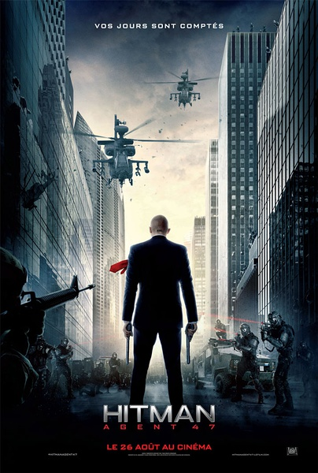
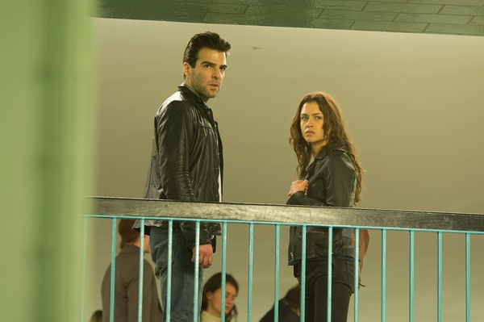

《杀手47（2015）Hitman: Agent 47》

			

老公的评论：

　　没想到这么短的时间就能看到一部电影的翻拍之作——说翻拍可能不是十分恰当，因为这两部电影都是根据游戏改编的，但是因为之前蒂莫西·奥利芬特饰演的特工47深深地印在了我们的脑海里，所以不会去想游戏如何如何，还是会把这两代47做一下比较的。

　　至少，在我看来，鲁伯特·弗兰德扮演的47号特工并没有输给蒂莫西·奥利芬特的47。

　　这一部的情节其实更有看点，故事不复杂，但是打斗很激烈，酷炫，我一直再说，看电影的本质意义之一就是猎奇，如果一部动作电影中的动作都是我们平常人能做出来的，那么也就不好看了。特工47在这部电影中不仅酷，而且和他的对手液态钛金属骨骼人的打斗也很有看点，我觉得这部电影一定会有续集，希望续集会是一部好看的美剧。

　　我很喜欢这种理性、没有感情能够左右是非判断的设定，这种人多么可怕，又是多么可爱！

　　47号和90号女主角已经成为了一个组合，他们会怎么面对未来呢？期待！

老婆的评论：

　　之前的《杀手47》我也很喜欢，像本片这种剧情简单然后又很打很酷的电影一直是我喜欢的。当然，相比之下，上一个杀手47更帅点。

　　好像美国的影视作品中有不少的改造人，通过改变基因，给人辐射，注射液体金属，我感觉为了制造更好战争武器，他们对战士无所不用其极。“代号47”（鲁伯特·弗兰德饰）就是一个被改造的杀手，他没有痛苦没有情绪……。

　　卡蒂娅（汉娜·韦尔饰）在找一个神秘男子，而又有2批人在找她，电影还是制造了一些悬念，看上去是来保护她的人却是来绑架她，而那个要来杀她的人却是来保护她。

　　当然，主人公没那么容易死的，所以47和卡蒂娅毁了那个集团，可惜卡蒂娅的爸爸死了。

上映年份　2015							
		
http://blog.sina.com.cn/s/blog_52187ba90102wgiv.html
