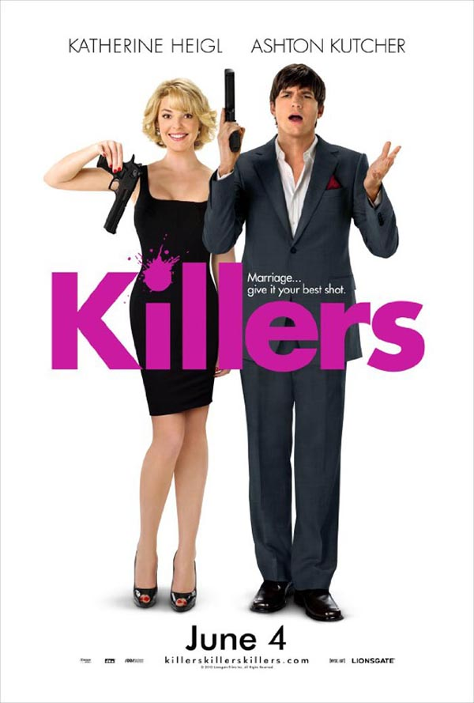
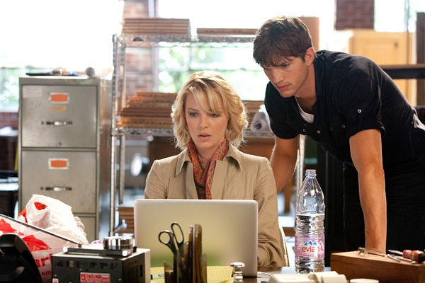

《杀手们 Killers》

			

老公的评论：
 
　　One day My Lord said to me that I should write my film review
in English to practice,It's too diffcult to me,but I think it's a
good idea......unless it's not.
 
　　Ok,let's get back to the main
point,Killers.In my opinion,to see this moive is a better choice
than the other comedy movie,I did't understand why the hero won the
"Golden Raspberry Award for Worst Actor",I think the actors are all
playing nice.
 
　　When we watched Killers,we thought this moive was a little
like "The Time Traveler's Wife",I don't mean the story,I mean the
feeling.
 
　　Although I like this movie,I have to admit it is a bit of an
exaggeration,but hey,it's a comedy,I can't imagine a comedy without
exaggeration.
 
　　The most interesting things is that almost all the people
around Spencer are all killers,the workmates,the
neighbours,everyone maybe kill Spencer for money,but why $20
million?I don't know,and it does't matter.
　　
　　This is my first film review in English,I know my English is very
poor,So,give me some help!Thank you!

老婆的评论：
 
　　有一段时间不看电影了，要找到一部好看的电影不太容易。不过，这是一部不错的电影，很轻松，很有味道。
 

　　失恋的简在父母陪同下去度假遇到杀手特工斯宾塞，两个人产生了感情，斯宾塞退出组织与简过简单平静的生活。电影用很短时间就交代完这些，三年后的一天，斯宾塞得老板似乎不想放过他，给了斯宾塞新的任务指示。
 

　　电影才算是真正的开始，忽然间斯宾塞的同事或者邻居都成了要斯宾塞性命的特工，因为斯宾塞的人头很值钱。简的世界忽然不同，她看见斯宾塞在杀人，在觉得斯宾塞对她隐瞒了事实生气外，她又发现自己怀孕了，在努力面对这些情况下，她还是站在了老公的那一头，哈！最有趣的是，简的爸爸也是特工，而且是下杀斯宾塞命令的那个人。
 
　　有没有人觉得阿什顿·库彻有点像阿汤哥？！电影刚开始时，我还以为是阿汤哥主演的呢。
 
上映年份 2010							
		
http://blog.sina.com.cn/s/blog_52187ba901016gvr.html
