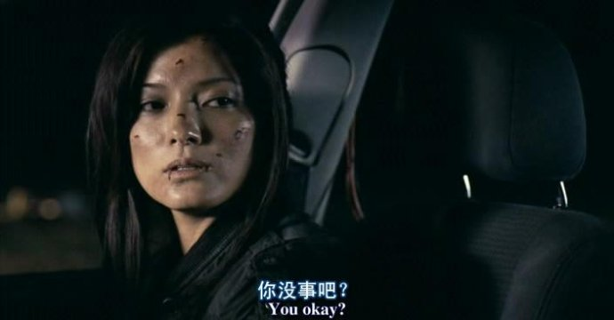

《杀手锦标赛 The Tournament》

			【夫妻影评】《杀手锦标赛 The Tournament》

老公的评论：
 

　　其实，只要不在我的身边，我觉得这种比赛还是多办点才好，让这样的杀手自相残杀，多有意思，至于那些有钱的老爷们谁爱下注，谁又赢了钱，干我何事？
 

　　胡凯莉在这部电影中扮相很漂亮，我对她的印象还停留在了蝎子王的剧情之中，这次她扮演的杀手郑莱莱够漂亮，打斗时候的身段也展示的很好。这样的影星，不知道她会不会说中文，不知道她是否还拿自己当中国人了……，还有，怎么看他也不像是68年生人，已经四十多岁了，还这种扮相，可怕！
 

　　剧情安排的紧凑，合理，我觉得要是一般的人，最后肯定是选择杀掉杀手及幕后的人为自己的妻子报仇，但作为杀手锦标赛的卫冕冠军，Joshua理解杀手的工作原理，所以他才能放过郑莱莱而去找锦标赛的主办方算账，还算是合理吧！
 

　　我想，这种情节的电影应该也可以被拍成连续剧吧，因为有些情节，我觉得在这部电影之中体现的还不够细致，比如为什么只有法国人一个人想到了取出追踪器，或者为什么没有杀手找人合作等等，都想为这样的剧集写剧本了，只是不知道有谁会拍。
 
　　很好看的电影，我想也会陪你度过快乐的一个多小时，特别是当你去体会那个神父的心情的时候，会很有感觉！

老婆的评论：
 
　　老实说看这部电影的时候，我总觉得这些人超变态，下赌的人变态，玩这个游戏的杀手也变态。
 
　　类似的影片之前看过，但这次不同的，杀手不再是囚徒，杀人游戏不再是置身某小岛，而是人们生活的小城市中。
 

　　胡凯莉扮演的女杀手比起其他的杀手要仁慈一些，虽然玩这个游戏，但绝不杀无辜的人，她保护着这个无辜牧师的安全。而文·瑞姆斯演的那个黑人杀手，真的很可怜，因为是上一届冠军，组委会为了让他再来参与这场游戏，把他老婆给杀了，真的很残忍。
 

　　这部影片最大的看点，就是为了争夺冠军杀手们使出浑身解数，要保住小命将杀人进行到底。　　　　　　　　　　　　　　　　　　
上映年份 2009
 
导演
Scott Mann
 
编剧
Gary Young
Jonathan Frank
 
主要演员
 

Lai Lai Zhen……Kelly Hu
郑莱莱……胡凯莉

MacAvoy……Robert Carlyle
麦卡沃伊……罗伯特·卡雷

Joshua……Ving Rhames
约什华……文·瑞姆斯							
		
http://blog.sina.com.cn/s/blog_52187ba90100hbj5.html
