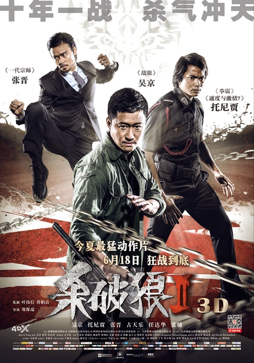
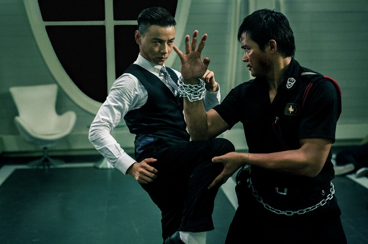
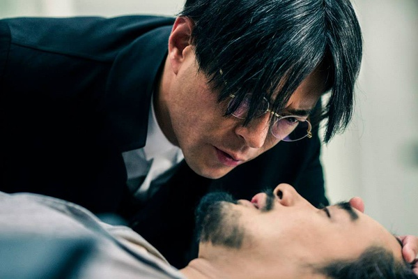
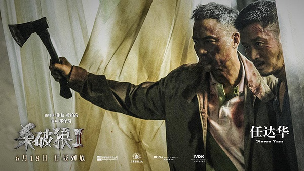

《杀破狼2》

			

老公的评论：

　　一直不是很喜欢吴京的扮相，但是他的打斗戏真的不错。这部电影整体来说有点混乱，但是节奏还算紧凑，看起来不觉得很费脑子，所以是一部放松休息时看的电影。

　　最近的一些合拍电影中，觉得张晋的颜值与气质真是帅到爆表，可惜呀，中国电影、电视剧，特别是港台电影电视剧已经习惯了让帅哥去扮演坏人，总是这样……

　　其实这种没有女角的功夫片还是真挺好看的，吴京、张晋、托尼贾的动作都很刚猛扎实，让我个年纪的人看了都觉得热血沸腾，想要去学学功夫了。

　　另一个感叹则是任达华与卢惠光这拨儿人真的老了，也该让让位了……

　　虽然结局不是很明白，虽然不知道为什么城市里会有狼，但这部片子打得够漂亮，也就够了。

老婆的评论：

　　这部电视的打斗还是非常的酷的，现在看很多动作片都用特效做出来的，感觉会很炫，但也不真实。所以，这部电影在动作方面花了心思，喜欢动作片的人，值得一看。

　　这个故事给人感觉就有点可怕了，为了利益，随便的抓人拿走其器官，这种利益集团，比卖毒品的人都可怕。

　　在故事的逻辑性上，我不是很明白陈志杰（吴京饰）在去泰国的路上完全可以跑走为什么不跑？因为那个人已经识破他的身份了。

　　要说人与人之间的缘分很奇妙，阿猜（托尼贾饰）肯定没想到他一直要找到那个人就在他身边。有的时候或许你只要做正确的事情，结果可能就会如愿，最后陈志杰还是救了阿猜的女儿。

　　还想再说一下吴京、托尼贾和张晋这场打斗真的很好看。

古天乐这次的扮相不好

上映年份　2015							
		
http://blog.sina.com.cn/s/blog_52187ba90102w3s2.html
