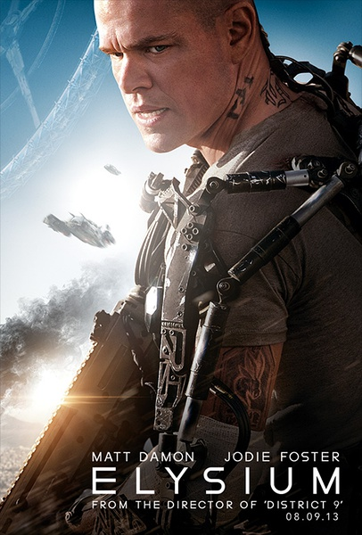
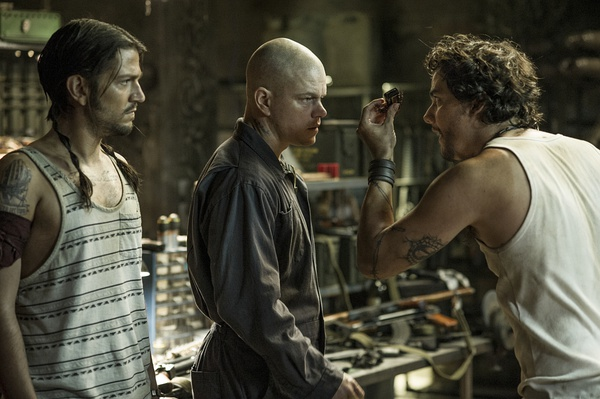

《极乐空间 Elysium》

			

老公的评论：
 

　　第一感觉是这部片子如果翻译成《乐土》会不会更贴切一下，“极乐空间”这四个字的歧义更多一些，并没有从根本上解释出电影想要表达的内涵。
 

　　从整体上来看，这部片子的节奏感要强于《星际穿越》，没有什么浪费的剧情，不过改造Max的时候多少有些让我不舒服，真奇怪为什么要有这种情节，不过想想是《第九区》的导演，也就平和了。
 

　　我觉得这部片子的结尾好像欠缺了点什么，不是因为主人公死了，而是因为主题虽然升华了，但是升华的还不够，只要“乐土”存在，地位差异就存在，等级观念就存在。
 

　　抽象地看，关于Max的逻辑挺值得玩味的：他本是为了求生才答应Spider的要求的，但实际上他从答应的那一刻就已经意味着他将必然死去，当然这是大家都不很清楚地。不过正是因为Max因为求生而死才产生了这个故事。
 
　　另外，八卦地看，“乐土”和《星际穿越》的空间站挺像的，是巧合吗？
 

老婆的评论：
 

　　这部电影很好看，剧情不拖拉，主线清晰，而且辅助的情节也倾入了感情。从本质上讲其实故事方面并没有多大的创新，这个极乐空间只是建在空中而已，就好像平民区和富人区的隔离，只是极乐空间有一个最厉害的玩意，他们的治疗仓很厉害，什么疾病都可以治好，像《V星入侵》的科技——外星科技额。
 

　　在某种意义上，我觉得神奇的治疗仓，也会毁了极乐空间的，人都不会生病，一个个活的挺长的，极乐空间就这么大，到时候资源一样消耗掉。
 

　　地球在未来真的会这样吗？科技的发展既让地球受到破坏，不是同时也应该可以拯救地球吗？人口的增长导致资源匮乏？不是也能发明一些合成药品，人吃一粒就可以第一天的食物嘛。
 

　　好吧，跑题了，回到故事上，主人公麦克斯在工作中被辐射了，没几天的命了，他要去极乐空间，可蜘蛛组织要他把极乐空间在地球出差的某富翁脑袋里的数据导入他脑袋里，只是他最后没想到他把数据导出来会死吧，但为了儿时的伙伴，也是无憾的吧！
 
　　他和极乐空间特工之间的打斗还是挺激烈的。
 

如此强悍的国防部长，可惜！

麦克斯最后虽然死了，但也算实现了儿时的梦想，保护他的小伙伴！
上映年份 2013							
		
http://blog.sina.com.cn/s/blog_52187ba90102vc9a.html
