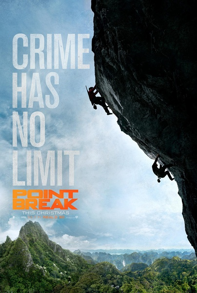

《极盗者 Point Break》

			

老公的评论：

　　这不是一部经典的动作影片，却绝对是一部经典的极限运动影片。

　　看过这部电影，更加深了我的一个观念：西方人口少于东方的理由一定包含极限运动。

　　看这部电影，看的就是一个“酷”字，所以，大多数所谓不合理的情节是可以忽略不计的，虽然知道很多拍摄镜头使用了替身，但即便是替身，也是在真实的场景之中完成的，从内心佩服这帮人，厉害！

　　如果让我编剧的话，我不会让博迪为首的那些极盗者杀人，我是指在炸掉金矿的那场戏里，他们的所作所为过了！炸掉金矿可以说是报答地球，但是那些保安什么的是无辜的，只是打工者，极盗者们的行为在这一刻让我变得不再支持他们……

　　这种片子看多了或许会麻木，但是这么久看到这么一部，真的很震撼，很过瘾。

老婆的评论：

　　将极限运动揉进案件中，这种尝试好像也不错。

　　在我看来，这部影片的看点在犹他（卢克·布雷西饰）和鲍迪（埃德加·拉米雷兹饰）为首要对八项巅峰运动挑战小团伙的极限运动表演。

　　不管是从天上跳下来到指定的洞穴，在巨大海浪中的冲浪，在高山雪地的滑雪，在悬崖边上的滑翔，还是无保护徒手攀岩那么陡峭的山，这些看的我心惊胆跳，当然也让人赏心悦目，那些景色这漂亮。

　　鲍迪他们要完成八项挑战，这是一种精神追求，而同时他们觉得大自然给予了他们天赋，所以需要回报地球，不过，后来越做越过分了，居然为了成全自己，杀起人来了，这是一种不完美。我猜这是编剧把他们更好的定位为坏人而这么编的。

　　犹他的冒险仍在继续，可他从队员的死，看到了不一样的东西，所以选择了去做特工。

　　路是自己选的，所以，即便鲍迪的小伙伴一个个相继死亡，大家烧了他然后仍继续冒险，再道一声，明天我们会再见的。

上映年份　2015							
		
http://blog.sina.com.cn/s/blog_52187ba90102wg3c.html
