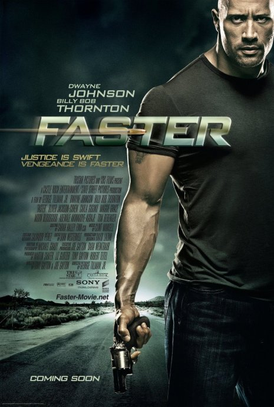

《极速复仇 Faster》

			【夫妻影评】《极速复仇 Faster》

老公的评论：
 

　　在新一代（其实年纪也都不是很小）的动作影星之中，最喜欢的莫过于斯坦森与巨石强森了，斯坦森的《机械师》还没有看，这部《极速复仇》感觉上虽然算不上多好，但绝对可看。
 

　　强森在剧中扮演一个复仇者，但并不是一个好人，他和自己的哥哥去抢劫银行，而后被黑吃黑，哥哥被杀死，他自己则顽强的活了下来，并且要复仇到底。
 

　　在主人公遇到自己的仇人的时候，并没有过多的废话，而是直接杀死对方，不需要仁慈、不需要怜悯，这点让人看得很痛快，如果要复仇，就应当这样，像那第四个仇人，因为让他说了太多的话，所以强森并没有杀死他，这点让我很不舒服，我觉得，并不是所有的错误都可以被原谅的。
 

　　不是说我们不应该宽容，也不是说我们做不到宽容，而是有些事情绝对不可以被原谅，被宽容。所以，人首先想到的，是不要犯错误，而不是在错误之后信誓旦旦地说什么可以改正！
 
　　至于电影中的那个神经病杀手和那个虚伪的警察，我觉得都可以忽略不计了，他们对电影的主题并没有产生丝毫的影响。
 

　　回来说说巨石先生，他的身材实在是太棒了，穿个皮夹克就站在那里，或者随便地走几步，就是一种视觉上的享受，好友小马比强森还要高一些，建议他往这条路上发展发展，嘿嘿！

老婆的评论：
 

　　这部影片的名字很直接，给人感觉是一部很暴力的影片。我和老公不喜欢这部影片的结尾，因为德雷沃原谅了黑牧师，这给完美复仇化上了瑕疵，还有德雷沃为什么不去找他哥哥之前的女友复仇？她是最值得被杀的人，正是她的出卖德雷沃的哥哥才会死的。
 

　　影片的开始很好看，巨石强森演的德雷沃基本上没有对白，他在奔跑寻找仇人，遇到之后并不废话，直接一枪致命，这样的复仇直接、简洁、大快人心。当然这里暂且不谈德雷沃的哥哥为什么被杀了，他们是不是有罪的人了。
 
　　影片中出来的杀手与剧情感觉有点脱节，安排的并不太好，糟践了这个帅杀手。
 

　　这部影片的基调挺冷的，有几个镜头让我印象很深刻，是德雷沃去杀黑牧师的路上，汽车在空旷的高速马路行走着，路边的景色越来越萧条，德雷沃的脸一点表情都没有。另一个画面是杀手在追逐德雷沃的路上，他驾着车，脸上也豪无表情。再一个画面是警察Cop也开着车追德雷沃来了，心思重重，复杂的情绪都写在脸上。这三幅画面切换在一起，怎么看怎么都是三个孤单的男人。
 
　　整部影片可看，但并不精彩。
上映年份
2011							
		
http://blog.sina.com.cn/s/blog_52187ba90100q5zx.html
