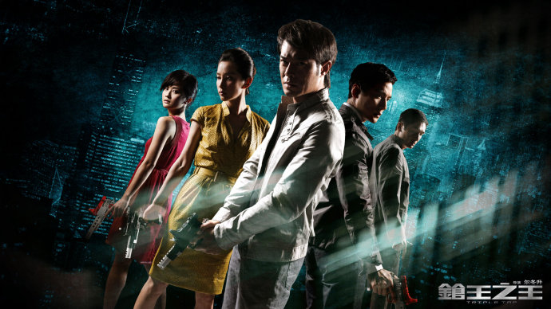
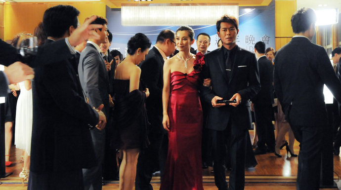

《枪王之王》

			【夫妻影评】《枪王之王》

老公的评论：
 

　　我觉得现在很多电影被人们觉得不好看，一个重要的原因是广告做的太过了。像这部电影，本来可以算是近年来港片中水平颇高的了，但对比他的广告，好像还是差了一些。
 
　　很主观的说，我对这部电影有两个不满意的地方：
 

　　一是觉得这个电影的名字有问题，整部电影的情节和“枪王”这个概念好像扯不上什么关系，《枪王之王》这个片名，会让人觉得这是一部很激烈的枪战片，可显然不是。
 

　　二是觉得吴彦祖演正面形象，古天乐演反面形象让我觉得多少有些另类，毕竟是习惯了古天乐的正统与吴彦祖的变态的，导演这么安排角色，也算是独具匠心吧，可惜没有深得我心。
 

　　整体来说，《枪王之王》的编剧显出了相当的功力，整个故事的情节紧凑，安排合理，对于物理和心灵方面的结合也很到位，可不知怎么，看这部电影，感觉上总是缺了点什么。
 

　　古天乐这个年龄段的演员很快就要老去了，我甚至都不知道能接替他的那拨演员都有什么人，真的希望香港电影能够有新的辉煌，能够有像《古惑仔》那样让我看了一遍又一遍的电影。
 

　　古天乐和吴彦祖在这部电影里的演技是觉得没问题的，吴彦祖的秉公办理，古天乐的装傻充愣，都让我看的很投入，加油吧！香港电影！
 
　　支持香港电影，盼望港产片的辉煌早次回归！
 

老婆的评论：
 

　　这部影片在一个偶然的机会与同事看了前半部分，只好让老公找来看完了，要说这部影片的观后感，我还真没什么想法。最近看了几部港片，给我的感觉都是看完之后好像什么都没看过的感觉，这部影片也一样。
 
　　虽然说主演古天乐和吴彦祖都是我喜欢的演员，可在这部影片中，他们都不怎么出彩，很平淡。
 

　　电影中的古天乐饰演的关友博这个角色，从开始给他塑造的枪法特准，救交警的英雄形象，而在事业方面他又非常成功，怎么看都像是好人，却在电影的中间部分交代其实他就是策划这次抢劫的幕后人物，这一切似乎来的有点早，让整部影片没有太大的悬念，剩下的就成了交代部分了。
 

　　结尾我不是很喜欢，不喜欢有两个方面，一方面关友博擅长犯罪心理学，他不可能没想到医院的交警没死，不至于对这个事情这么偏执。另一方面，阿Sa饰的婷婷，又有何种动机非要试试关友博的清白，既然她能容忍关友博与他女上司之间的事，说明她的爱挺盲目的，没道理她会这么做的。
 
　　此次阿Sa的表演，也很是一般。
 
上映年份
2010							
		
http://blog.sina.com.cn/s/blog_52187ba90100ng5f.html
