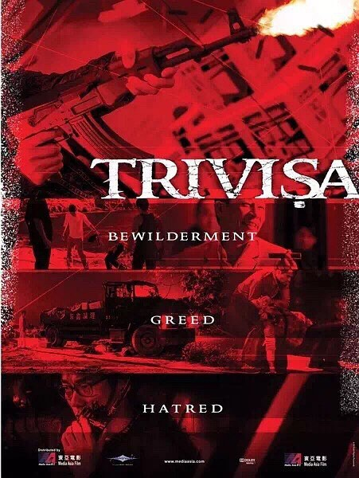

《树大招风》

			

<b>老公的评论：</b>

　　感觉这部电影是港片里比较强的一部，且不管这部电影的原形故事，但是三位主演的表现，就足以让我觉得这部港片的编剧很厉害。

　　首先让我感觉意外的是任贤齐的造型，其实任贤齐斯文的样子演反派已经很难了，还要扮演一个动辄开枪的“贼王”，意外的造型，过小齐的表演还是很到位的；

　　其次出彩的是林家栋和陈小春所饰演角色的“变态”，感觉上任贤齐扮演的角色虽然暴力一些，但是还算是一个正常的性格，但是林家栋和陈小春所扮演的角色就实在是有些“出格”了；

　　再次的是虽然这是一部警匪片，但是很有些黑色幽默的感觉，无论怎么说，搞笑的场景总是会让人更喜欢一部文艺作品的，我觉得这部电影最有趣的一幕就是卓子强在谈判过程中电话分别被叶国欢和季正雄拨通……

　　最后，我觉得这部电影虽然立意不是那么突出，但是却把“三而为一”的故事讲的很好，短短的篇幅对于主角的性格背景阐述的很清楚，站在一部文艺作品的角度而言，很出色。

<b>老婆的评论：</b>

　　三个贼王就这样把自己玩死了，真的很让人惊讶啊。

　　我看卓子强（陈小春饰）就是一个变态，他在绑架一家富豪得到巨额资金，不收手不藏匿，还不停的绑架其他人，这样的他居然觉得好无聊，想再干点什么大事，忽然知道道上传来三大贼王要合作的消息，居然觉得这个是好主意，还因此开通专线找其他两个贼王，付钱找消息不说，为了知道其他贼王的消息，他真的敢自己去见其他黑帮，结果被抓住了。

　　叶国欢（任贤齐饰）这个人呢，我以为在这三人中，本来应该有改过的机会，在一次打劫成功后，知道走私赚钱，他开始走私，在不断和官员打交道的过程中，被贪婪、腐败的官员呼来喝去的使唤和压榨，让他忍受不了，想离开这种生活，终于他和卓子强联系上，性格决定了一切，他因忍受不了香港警察的语言侮辱，开枪杀死俩警察后被其他的警察杀死了。

　　季正雄（林家栋饰）这个人呢，他很凶残，他回到香港后，住在他以前的一个小弟家，他想打劫对面那家金铺，后来不知道是不是想和卓子强合作而改变主意，为了不暴露自己新找来的两个小弟说杀就杀，他甚至想杀了以前那家小弟，因为他太凶残了，应该被那小弟给举报了，警察把他围住了。

　　后来，看这三个人这样的死了，我甚至怀疑，道上传出三大贼王合作的事情，这是一个针对他们的阴谋。当然，也有可能是他们在饭馆的一次偶遇，导致道上的疯传，可归根结底，是他们三人自己的选择。

林家栋饰季正雄

陈小春饰卓子强

任贤齐饰叶国欢

上映年份：2016
							
		
http://blog.sina.com.cn/s/blog_52187ba90102x8qr.html
