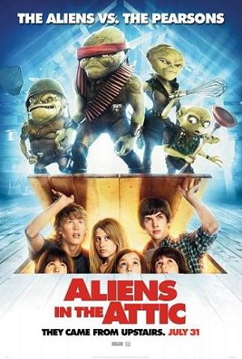

《楼上的外星人 Aliens in the Attic》

			【夫妻影评】《楼上的外星人 Aliens in the Attic》

老公的评论：
 

　　这是一个很好玩的电影，外星人的个头那么小，居然还想着进攻人类，很有意思，和老婆大人商量，如果遇到这样的外星人，真的可以考虑放到家里一个养一养。
 

　　和《奇幻精灵事件薄》相比较，这部电影显得更童趣一些，恶搞“男朋友”与“奶奶变身”都是很有意思的场景，几个小朋友用手柄“真人快打”也设计的很好玩。
 
　　对于这样一部电影，我其实说不出什么太多，或许这部电影不会让我笑的喷饭，但却可以让我一直保持脸上微笑的表情90分钟。
 
老婆的评论：
 
　　这是一部适合与小朋友一起看的电影，可以看看。
 

　　外星人到底长的什么样？有没有机会遇到？如果你与主人公一样，在家里楼顶上遇到外星人，这些外星人有好有坏，你又是怎样面对？
 
　　其实我最喜欢的情节，是这些孩子们恶整姐姐的男友，拿外星人的遥控器，使劲的折腾他。哈哈！太搞笑了。
 
　　其他的情节倒是一般。
 
 
上映年份2009

主要演员Tom……Carter Jenkins
Jake……Austin Robert Butler							
		
http://blog.sina.com.cn/s/blog_52187ba90100lmm2.html
