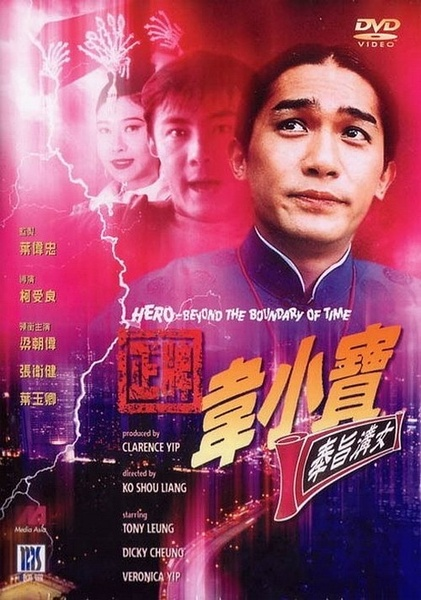
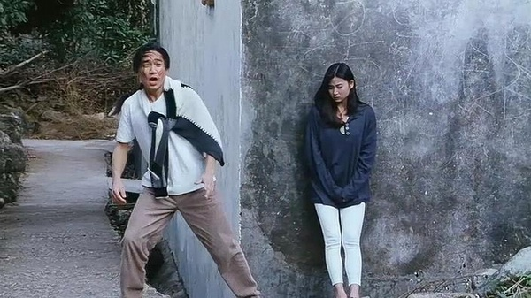
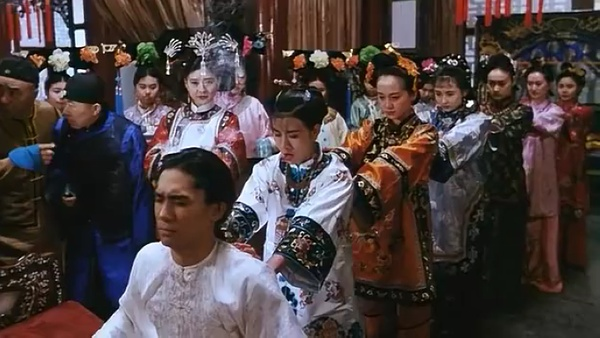

《正牌韦小宝之奉旨沟女》

			

老公的评论：
 

　　有多少朋友看过这部电影，有多少朋友在九十年代就看过这部电影呢？因为看完英超转播，乱播电视看到了电视台再放这部电影，老婆大人说没看过，所以决定找来重看一遍。
 

　　看看周围，更多的朋友喜欢周星驰，这固然和周星驰的演技、创造力有关系，但是另一个无法否认的事实就是：周星驰赶上了“电影时代”，梁朝伟扮演无厘头的历史其实要悠久的多，只不过他的很多电影、电视剧并没有赶上公映的好时候吧。
 

　　我是因为《鹿鼎记》、《侠客行》这两部连续剧喜欢上梁朝伟的，连带了后来的周星驰和张家辉，坦白说，在这三个人之后，只有郑中基勉强能顶一顶，香港再无喜剧巨星了，真的怀念老港片，希望香港电影人能够早日重返辉煌。
 

　　有一些朋友觉得这部电影和《鹿鼎记》、韦小宝没有什么关系，其实不然，主人公正是借用了韦小宝的性格，而且，梁朝伟版的韦小宝真的是正牌韦小宝啊！
 
　　张卫健那个时候真的很年轻，不像现在一副老男人的邋遢样，那个时候混个帅哥还是可以的。
 
　　这部电影的女主角是差了一些，不过考虑时代啊什么的，也就这样了，重要的是看梁朝伟耍宝嘛！

老婆的评论：
 
　　无意中在电视台看见这部电影了，觉得很好看，看了一会，但当时时间有点晚，再加上我以为是电视剧，就让老公改天找来看。
 

　　老港片梁朝伟的那种无厘头，老公很喜欢，我想他多多少少的影响了我，就像梁朝伟在小霞身边找来找去找小霞这样，老公也经常这样找我逗我玩。
 

　　从去过穿越到现在，还真是不太好设计，因为穿越的机器和当时的文化，在这部电影中简单的点出来，而小宝（梁朝伟饰）来到现在，带着他的珠宝是转的通的，还有他那副早在皇帝身边练就的油嘴滑舌还不吃亏的本领。
 

　　当然，这部电影看得就是小宝和来到现代交的朋友阿超（张卫健饰）耍宝，乐呵呵的就看完了。没想到他最后还把小霞给泡到手，并把他的其他老婆接到现代，故事就结束了。

上映年份 1993							
		
http://blog.sina.com.cn/s/blog_52187ba901017hbg.html
