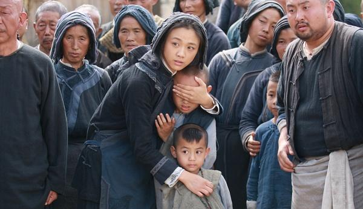

《武侠》

			

 
老公的评论：
 

　　说起来，在香港演员当中，现在是相当喜欢甄子丹的，特别是他在《叶问》之中给角色塑造的那种武功绝顶却又很平和的感觉，和中国传统侠客的风范。
 

　　回到《武侠》来看，这部片子对于我的口味来说，打斗的场面不够霸道，也不够王道，好像回到了七八十年代，不过故事的塑造整体来说还是很有意思的。
 

　　金城武出演的捕快陈百九以第一人称来看待整个事件，从一些蛛丝马迹发现了刘金喜和别人不同的地方，但正是他的这个发现，给山中平静的小村庄带来了杀戮，给隐姓埋名多年的唐龙带来了血腥，也给自己招致了杀身之祸。有一句话被经常提及“给别人机会就是给自己机会”，陈百九没有给唐龙机会，也就失去了自己的机会。
 

　　相对于故事情节而言，我觉得电影中的风景也非常之秀丽，和老婆大人的家乡差不多，只不过，我之前没有见过把牛样在一楼楼顶的，感觉还挺有趣，楼顶得多结识才能让牛在上边生活啊！
 

　　香港电影需要繁荣，但个人感觉现在的导演又有点过了，动作片也要拼命地强调情节，会不会显得不伦不类，唉，仁智之间多难定啊！
 

 
老婆的评论：
 
　　看这部电影是冲着甄子丹去的，结果他让我们失望了，没有那种打十个的那种气派了，也没有让人折服的武术表演了。
 

　　本片金城武演的县衙捕快徐百九还挺逗的，只是我不明白他为什么要讲四川话？他在本片里怎么相似精神分裂的人呢？人真是两种性格组成的善良和邪恶，在最后那一刻，是善良战胜了邪恶，他救了刘金喜。
 

　　我不明白古代的人，为什么砍了自己就是对别人有交代？干嘛不留点力气和坏人打呢。刘金喜砍断自己的胳膊还不是要和他的义父较量，他的义父也没有因为这样而放过他。
 
　　没想到这部影片惠英红还来客串一下。而这也是我第一次看汤唯的主演的影片，我觉得她当主演还差点意思。							
		
http://blog.sina.com.cn/s/blog_52187ba90100wg77.html
