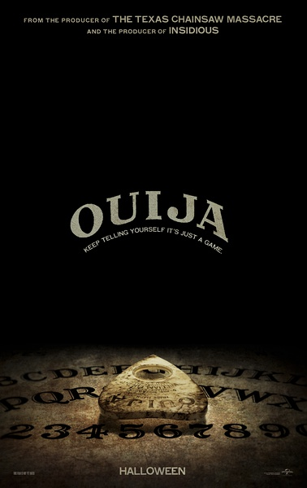
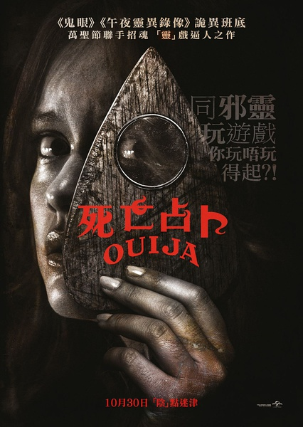
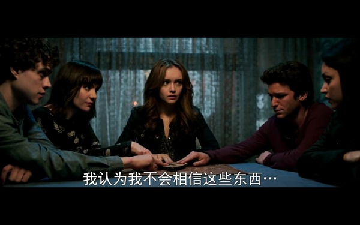

《死亡占卜 Ouija》

			

老公的评论：

　　第一个想说的，是我真的不明白这部电影的评分为什么那么低！投资五百万美元，票房七百万美元，这还不够吗？

　　在我们看来，这部电影基本算不上是恐怖片了，里面的场景和理念都不恐怖，即使是关了灯之后在黑暗的房间中独自回想，也没有觉得这部电影有什么值得担心害怕的……

　　我个人是非常喜欢文化的，我觉得通灵板是一种地域文化的表现，就像什么“碟仙”、“笔仙”一样，看这样的故事并不是一定要追求什么结果，而是对一种特殊文化的了解。

　　这部电影的主线，就在于“不要在墓地使用通灵板，而主人公们恰恰不知道他们使用通灵板的房屋因为藏有死人，所以成为了一个墓地……”，这种传说文化就好像是吸血鬼怕阳光、十字架；僵尸必须要砍掉脑袋才能死亡一样，属于民间传说的一部分，在我看来只是有趣味，而非恐怖。

　　在我印象中，很多美剧里都有关于通灵板的概念，《邪恶力量》里面应该就有过，所以这样的题材已经无法被我划为恐怖之中了。

　　听说这部电影还要拍续集，不管网上的评论怎么说，我觉得可以看看。

老婆的评论：

　　黛比（雪莱·亨尼格饰）走了，她的好朋友莱妮（奥利维亚·库克饰）不太相信黛比是自杀的，她想尽办法调查真相。

　　大部分时候了解真相是要付出代价的。黛比不仅自己要查，还要求黛比的男友皮特、好友伊莎贝尔、自己的男友特里弗还带上了妹妹萨拉一起，他们拿到黛比的遗物占卜板，一起走向了追查真相的路上。

　　我看这部电影的时候，很着急，这五个小伙伴，伊莎贝尔死了，皮特死了，特里弗也死了，在这种惊恐的日子里，她们终于找到了解决的方法。

　　至于电影中，占卜板和那具尸体能连接什么样的世界，在这部电影里显得一点都不重要。

　　有的时候，我特别的为这些人不值得，牺牲的太多，可不得不说，这些人是勇敢的……。

上映年份 2014
							
		
http://blog.sina.com.cn/s/blog_52187ba90102wse7.html
