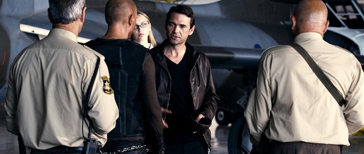

《死亡飞车3 Death Race3》

			

老公的评论：

　　看这个系列其实是因为喜欢拍摄第一部的杰森·斯坦森，感觉这个系列的题材还算挺酷，所以就算后边两部不是他演的了，也跟着看了下来。

　　除了赛车之外，这部新作里加入了更多的元素，比如财团老板间的斗争，比如在非洲赛车还要和当地的军阀火拼……，小胖子没有逃走有点出乎我的意料，但是也算是合理，并且是为下一步续集留点伏笔吧。

　　需要批评一下的是这部电影的特效，那些参赛的车实在是太不像能够承载重武器的车了，而且好像有一些镜头没有处理好。看赛车题材的电影，其中重要的部分之一就是看车，这部电影中的车实在是不够提气。

　　我本人不是很喜欢赛车题材的电影，而《死亡飞车》系列又没真的做到绝对的吸引人，所以，如果有下一部的话，可看可不看吧。

老婆的评论：

　　在我看来，这无疑是一部很刺激的电影。很好看的电影！

　　与第二部有关联性，又新增加了角色，那个嚣张的讨厌的新老板塞瑟，完全不顾卢卡斯团队与之前的老板达成的协议，只要再赢一场，卢卡斯他们就可以自由了。

　　一方面要应对同时竞赛那些疯狂的狱友们保住小命，一方面还要想办法对付塞瑟，而此时的卢卡斯并没有特别的被团队信任。经过几场比赛，他们的关系也恢复了。

　　在最后那场比赛中，塞瑟要求卢卡斯输给14K，而对于卢卡斯来说，这不是一场比赛，在其他人员的配合下，他们逃脱了，并且塞瑟转变成了弗兰克，这很成功，应验了恶人自有恶人磨。

　　在这里，赛车不仅仅是需要速度，而是拼命，为了赢就要杀死一切有威胁的对手，还有意思的，南非当地百姓非常的疯狂，就这么追着车子打，这个地方我可不敢去，还有这里的军阀，也太无聊吧。　

塞瑟要成为新的弗兰克

上映年份 2013							
		
http://blog.sina.com.cn/s/blog_52187ba90102vpe8.html
