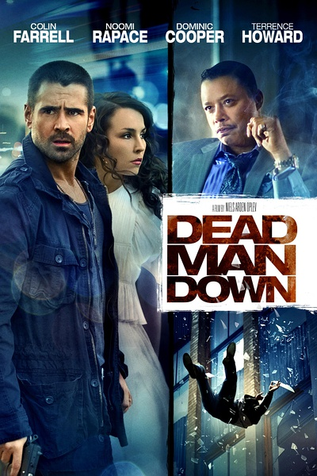
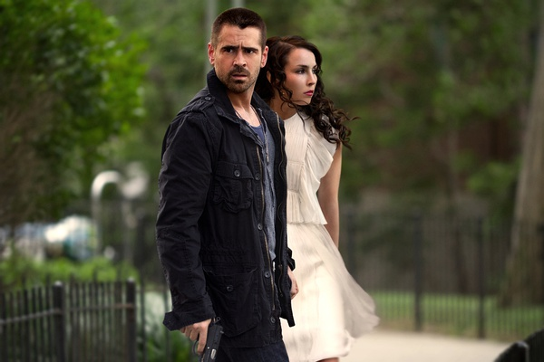

《死人的复仇 Dead Man Down》

			

老公的评论：

　　科林·法瑞尔是我们都比较喜欢的演员，这是我们看完这个电影的要素之一，另外，这部电影的节奏虽然不快，但是在题材上算是有创新吧，还是有一些看点的。

　　复仇是孤胆英雄电影常见的题材，不过这部电影里牵扯了两个复仇的主线，一条主线讲的快意恩仇，但是另一条主线讲的则是宽恕，按说这两个主线是矛盾的，但是因为人的不同，环境的不同，这两条复仇主线和两种结果共存的还不错。

　　我不知道有多少人可以用宽恕来释放仇恨，我觉得我自己对于真正的仇恨也是做不到宽恕的，但是凡事都有个限度，到底怎样的复仇才算是在限度之内的？才算既出了气，又不会让自己后悔呢？这点好像很难把握。

　　在看电影的时候，我为女主人公放下了仇恨而感到轻松，也为男主人公大杀特杀而感到痛快，多矛盾啊。所以这是一部可看的电影，虽然整个调子有一点灰暗，但是绝对可看。

老婆的评论：

　　复仇是一个很好的电影题材，一个已死的人复仇增加了悬念，当然，这人必须足够厉害了，维克多（柯林
法瑞尔饰）够强悍，我们不要去质疑为什么他会这么厉害？重要的是，我们看的是他如何完成复仇。

　　电影开始一会，我就觉得保罗的死是有人故作神秘来挑起黑帮内斗，而站在边上的维克多很有嫌疑，后来看来比这个还有复杂点，这些是我在没有看到片名的情况下做出的猜测。

　　我想维克多要杀埃尔夫斯（泰伦斯
霍华德饰）其实很快就能完成，可他有点像猫抓老鼠那般，先吓先玩，还想做局让另一帮仇人和埃尔夫斯互拼。也许他自己根本没想再活下去。

　　有意思的是，维克多被他的女邻居碧翠丝（劳米
拉佩斯饰）勒索，要求他为她杀人复仇，这个让电影有了新的变化。而这两人在这个过程中又产生了爱意。

　　我很高兴最后维克多为他的妻子和孩子报了仇。

上映年份 2013							
		
http://blog.sina.com.cn/s/blog_52187ba90102vp4m.html
