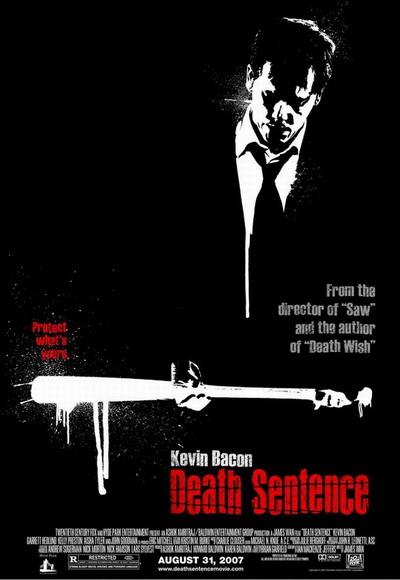
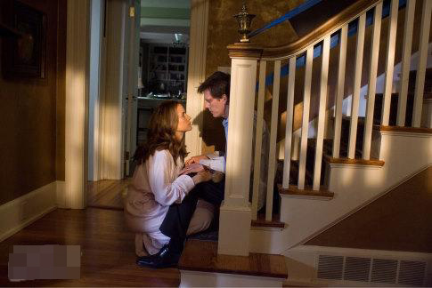
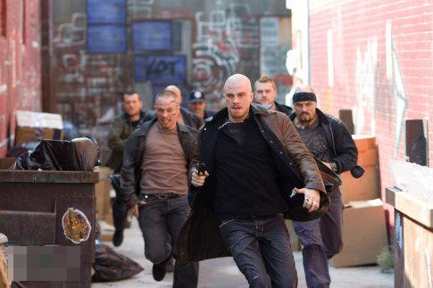

《死刑 Death Sentence》

			

老公的评论：
 
　　这是一部没有什么大场面的电影，即使是枪战，也更像是在摄影棚里完成的，但是，这部电影确实是我和老婆大人都很喜欢的题材。
 

　　在我看来，复仇不应该是这部电影的主题，真正的主题应当是正义。在现实生活当中，我们每个人都有可能遇到不公平的对待，而我们怎么去处理这样的事情，确实是个值得思考的问题。
 
　　在生活之中，我们不可能像电影中那样随便的买到枪支去挑战一个什么帮派，所以，电影的价值就体现出来了。
 
　　我觉得这部电影我不满意的地方就是应该让主人公再强悍一些，有过什么特种兵背景什么的就更过瘾了，场面会更激烈。
 
　　查资料的时候听说这部电影的导演是擅长拍恐怖片的，这部电影还真没有，相反，播放家庭录像的部分让我觉得还很温馨。

老婆的评论：
 

　　直观的看尼克·休姆并没有做错什么，只是觉得他要复仇前应该把老婆孩子给安排好。个人还觉得他是一个勇敢的人，敢去挑战一个黑帮，不过，从另一方面看，本片的警察很笨也很没有用，但凡他们厉害一点，结局也不应该是这样的，我想现实中的警察也应该是这样的吧，不像我们看的美剧中的一些警察那么的厉害。
 
　　要是法律能公正一点，判那个杀死他儿子的凶手死刑或者终身监禁，或许就没有之后的故事了。
 

　　电影开头用了不同的镜头来展现这是一个幸福的家庭，男主人公尼克·休姆事业有成，而家庭生活也非常的美满，这美好的一切，就因为一个黑帮的入帮仪式，杀死了他的大儿子。尼克·休姆为了惩罚凶手杀了凶手，而凶手的哥哥又来报复他而灭他们全家，他没死又去报仇，真是应验了冤冤相报何时了？！
 
　　剧情很紧凑，人物形象塑造的夜很成功，总体来说这影片也不错！

上映年份：2007
主演
凯文·贝肯							
		
http://blog.sina.com.cn/s/blog_52187ba90101228y.html
