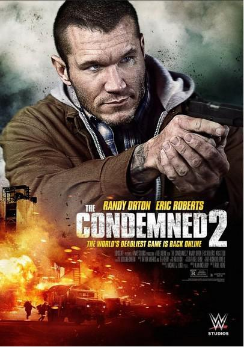
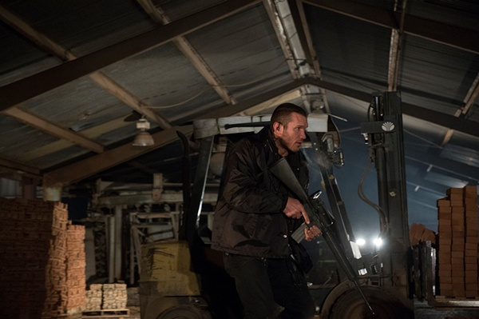
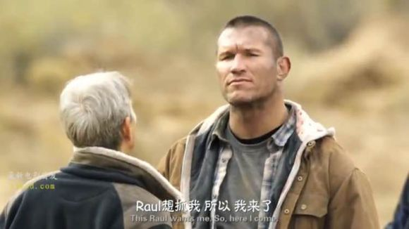

《死囚大逃杀2 The Condemned 2》

			

老公的评论：

　　整体来说，我觉得WWE系列的电影要比漫威系列的好看。因为比较看过的影片，WWE出身的演员们拍的电影虽然未必是大制作，故事也相对简单，但是好在节奏紧凑，而且不烧脑，没有太多前因后果，看起来干脆利落。

　　主演兰迪·奥顿居然是个快两米的大个子，可能是因为他太强壮了吧，在片中显得很壮，但是没有那么高，在知道之后觉得真恐怖，估计见到他本人的话，真的像是面对一个大熊一样。

　　至于电影的情节，对于这类从头打到尾的动作电影通常我是不评价的，也说不出什么，反正就是打呗，而且好人总会受点伤，好人最终总是会胜利……

　　关于电影的主题我倒是想说点：其实赏金猎人的题材是很酷的，不论是星际赏金猎人、恶魔赏金猎人、还是罪犯赏金猎人，可是这个题材的电影、特别是电视剧却并没有特别好看的作品，很期待！哈哈，其实还是喜欢美剧更多一些，期待有个好的赏金猎人的美剧出现吧！

　　家中爆米花电影，可看！

老婆的评论：

　　这部电影相对来说没什么创意，但还能看的原因，够打。从头达到尾，很暴力也很纯粹。

　　赏金猎人威尔带领团队捉拿赛勒斯，不小心导致赛勒斯死了，他因过失杀人而获刑，之后威尔不想再过这种生活。

　　前队友一个个的忽然出现，可都是为了杀了他，这种追杀的情节持续着，还好的是他总算有一个前队友可帮他，要不然做人太失败了。

　　疯狂的赌徒正在下注，赛勒斯的兄弟又引起了另一个赌博狂热，他正用那双充满仇恨的眼睛盯着屏幕，希望其他人杀了威尔，在其他人不断失败后，他决定自己去对决。

　　威尔的爸爸，这老头还真是够强悍的。

上映年份　2015
							
		
http://blog.sina.com.cn/s/blog_52187ba90102wfgm.html
