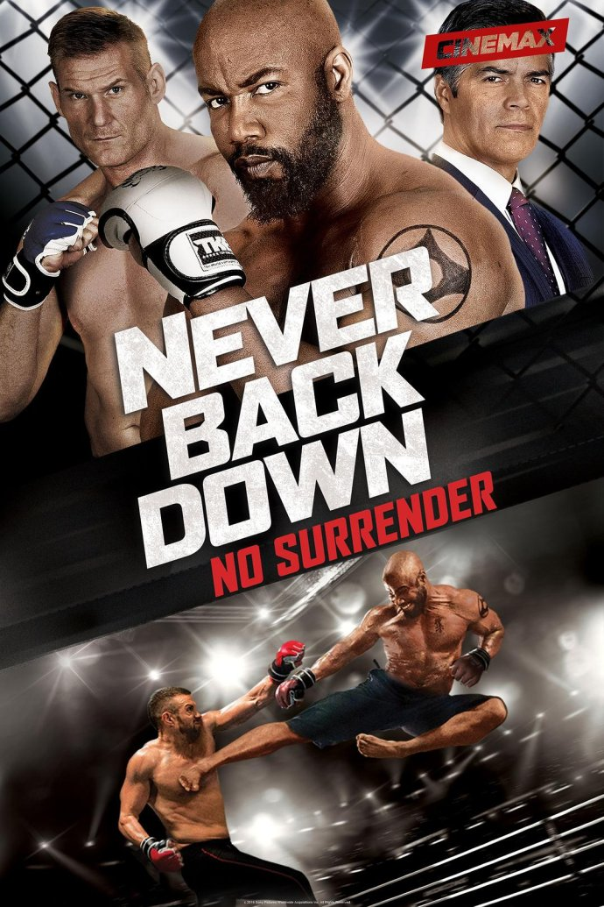
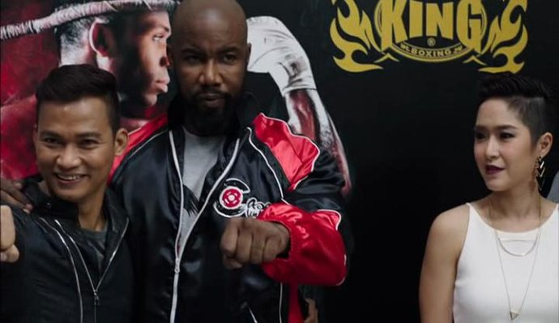

《永不退缩 3 Never Back Down: No Surrender》

			

老公的评论：

　　其实是还算好看的一部搏击动作电影，除了布鲁迪莫名其妙地和凯斯打的那架，其他的都还是按部就班地发展的。

　　迈克尔·加·怀特的扮相还是有可看性的，电影中那段打败四个警察的视频真的很精彩，虽然知道有些动作相对夸张了一些，但是电影嘛，好看就行了。

　　我本人并不是很喜欢西方的格斗，所以如果没有故事情节的话，拳击类格斗的片子我基本不看的，包括当年红极一时的《洛奇》我都觉得要比史泰龙的其他电影要差一些。不过这部《永不退缩
3》还算是可以吧，其中换掉布鲁迪的类固醇的那个桥段还是真的很冷幽默的。

　　我觉得自己也在变化，开始越来越适应快餐文化了。其实这部电影之中并没有什么累赘的部分，没有什么浪费的细节，但是总是觉得节奏还不够快。真的是有些不适应这些叙事严谨但是切入主题慢的文艺作品了。

　　托尼·贾在这部电影中也客串了一下，还是挺逗的。

　　没什么好与不好，爆米花电影！

老婆的评论：

　　在我看来，这种电影太简单了，导致我不知道该怎么写观后感。

　　作为拳手凯斯太有原则，不是说这不好，而是拳击比赛，除了用本身的力量去征服对手外，我想这种比赛也是一种秀，也具有表演性，作为举办赛事的人，他们也要从中获取利润。所以凯斯的原则可能不适合这种赛事，他的教练离他而去。他遇到另一个拳击手布鲁迪，布鲁迪请他当自己的教练。

　　在拳馆凯斯的另类练习吸引了两个小拳手，他们跟着他学习，但也引起了赛事主办人的不喜，当他那段打败四个警察的视频火爆起来，赛事主办人觉得他比布鲁迪更有吸引力，把布鲁迪给暗伤后要他当拳手。

　　我看凯斯不声不响的把布鲁迪的类固醇换下来这段还挺逗得。

　　最终，凯斯想到了怎么惩罚赛事主办人的方法，他赢得了胜利。

　　额，托尼·贾也来凑了一下热闹，有意思。

上映年份：2016							
		
http://blog.sina.com.cn/s/blog_52187ba90102x8si.html
