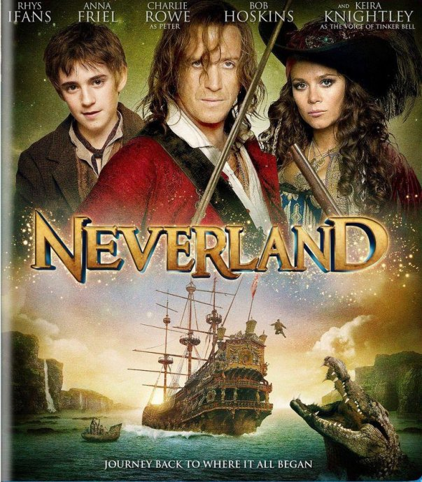
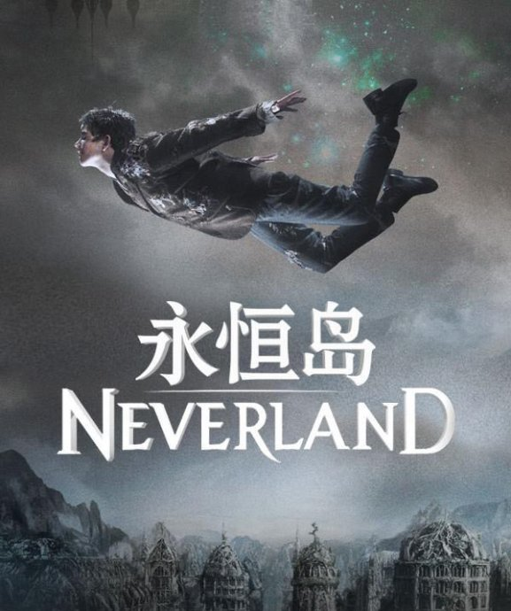
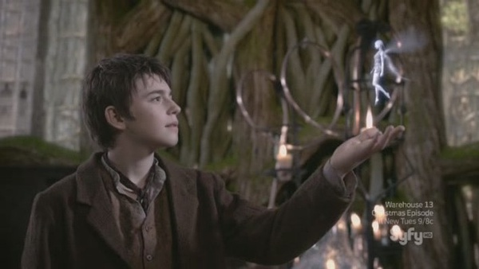

《永恒岛 Never Land》

			

老公的评论：
 
　　我对《小飞侠》的故事没有什么感觉，但是这部《永恒岛》还是挺有意思的。
 

　　这个童话故事衍生出来的电影让人感觉很轻松，虎克船长不是好人我是早就知道了，所以当他在船上报出他的真名字的时候，以后再演变成坏人我就没有什么意外了。
 

　　对于我来说，这部片子最打动我的是最后主人公说的那番话，有谁不想生活在他所描述的那种永远是孩子，永远天真，永远没有大人欺骗的世界里呢？
 
　　其实，既然他们不会变老，那么努力去挖那颗水晶球也还是有机会的，总来得及。
 

　　这个故事让我遗憾的部分是Fox的死，无论在什么文艺作品之中，看到孩子被杀死都是让人挺伤感的事情，唉，希望续集能让他复活吧。
 
　　酋长的女人被称作美女，挺符合我看过的英剧的风格的，《Doctor
Who》、《Merlin》都是如此，挺有地域特色的。
 
　　希望有续集，真的很希望！

老婆的评论：
 
　　是啊，Peter的影子为什么不见了？
 

　　如果真有这样的岛，老公说一定要带我去。恩，挺让人向往的，想想不能太老的时候去，要趁年轻时去，在那可以永远的停留在现在这个年龄，这是一件不错的事情。
 

　　最讨厌那些海盗了，他们还真敢破坏这样一个美丽的世界，为什么不向印第安人学习一下呢？把永恒岛当自己的家，大家都能相处的很好。额，最坏的还是算Jimmy，他为了一己之私，利用对他一直很信任的Peter，还烧死那么多的小精灵，最让我不能容忍。假如影片还编的话，他就是那个虎克船长，要一直和Peter斗了吧。
 

　　看的时候，我还很气愤，Peter为什么会带Jimmy去小精灵那，后来想想也很正常，Peter还是一个小朋友，他一直把Jimmy当偶像，还不是几句话就被Jimmy搞定。

上映年份：2011							
		
http://blog.sina.com.cn/s/blog_52187ba901014uxs.html
