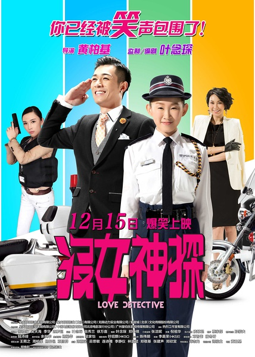
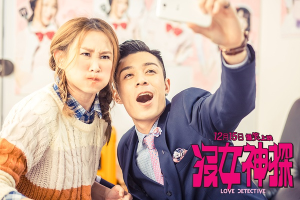
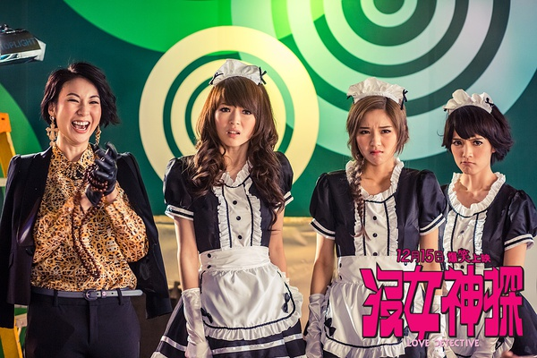

《没女神探》

			

老公的评论：
 

　　一直是知道王菀之和周柏豪的，一直也是很喜欢原汁原味的港产电影的，只是随着这些年港片的没落以及综艺的盛行而忽视了这批30岁左右的艺人。百度了一下，原来王菀之也不是30左右了……
 
　　王菀之很像林忆莲，哈，是因为那双小眼睛吧、而周柏豪则很像六小龄童家族的晚辈。
 

　　这个故事是一个纯搞笑的故事，没有太多的情节可言，而且，我们都觉得这个片子的搞笑很有些低俗的地方，有很多地方有老港片的感觉。
 
　　低俗也算是低俗了，不过还是有笑点可看的，能被我们坚持着看完，算是能到及格线吧。没什么太多好说的

老婆的评论：
 

　　失恋的女神探阿宝（王菀之饰）窝在家里一年了，她被前男友给刺激了。这次领导（蒋志光饰）终于有理由来说服她上班了，因为她的前男友死了，理由是她要前去那家娱乐公司卧底能了解到为什么前男友要那几个嫩模而不要她。
 

　　阿宝破案能力挺强的，但长相却一般，到了娱乐公司任清洁员，无意被经济人推到组合团体里，为了恶补她的形象，造型和气质，警局给她找了三个猥琐男，其实，我真觉得这些没必要，看着这三人形象挺恶心的。
 
　　阿宝慢慢的接近了案件的真相，期间和公司老板有点娘娘腔的儿子成大志（周柏豪饰）产生了感情，这真是绝配啊。
 
　　其实，这部电影我觉得可以不看，因为格调实在有点低。

 

上映年份　2015　							
		
http://blog.sina.com.cn/s/blog_52187ba90102wc98.html
