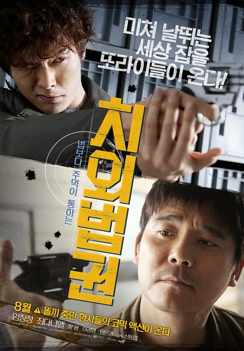

《治外法权》

			

老公的评论：

　　在我看来，这是一部很另类的喜剧，有些欧洲黑色冷幽默的感觉。

　　现在有很多很流行的漫画被改编成电影电视剧，我到觉得这部电影更像是漫画改编的，如果漫画里有这样两个警察我觉得是非常有趣的。

　　应该说，这个故事成立的先决条件是它必须成立在一个架空的世界中，即便电影中几次强调韩国如何如何，但是能够允许这样的警察存在，本身的法律和社会就必须是架空的。

　　故事虽然虚构，但是也有一定的合理性——虽然两个主人公都很能打，但是两个人也有吃瘪的时候，也会被人抓住，被人打败——这点让整个故事不会太过于“漫画化”。

　　任昌丁算不上帅哥，甚至太过于沧桑，崔丹尼尔不笑的时候还好，一笑起来真不容易找到眼睛在哪里……，哈哈，而且这部电影的剧情也很简单，甚至在一开始就已经揭露了谁是好人、谁是奸角，所以，不用期待故事的情节有什么悬念，看看两个主角搞怪，捡捡乐儿就行了！

老婆的评论：

　　没想到看了一部韩国的电影，整体来说，这部电影只能算一般。

　　一个庞大的犯罪组织，一个由信仰延伸的犯罪组织很可怕，看着这些疯狂的教徒，我不知道该说些什么，可以让人心甘情愿的贡献生命和一切，真的很可怕。而这样的组织，还可以从学校招募那么多的人，很可怕。

　　这个组织警察拿他们没有办法，所以警察局想出一个办法，以夷制夷，用两个不听话的警察去对付这个组织。

　　一个无所顾忌的组织，怎么会被这两个人郑振（任昌丁饰）犯罪心理专家挺喜欢暴力解决问题和他的搭档有民（崔丹尼尔饰）挺喜欢女色搞定呢？很不合逻辑，在他们俩潜入组织内部时，我看他们除了犯傻之外，我没觉得有什么本领啊。

　　最后奇迹般的制胜，我看不是因为警察两人组，而是因为组织本身出了问题。

上映年份 2015							
		
http://blog.sina.com.cn/s/blog_52187ba90102wmvr.html
