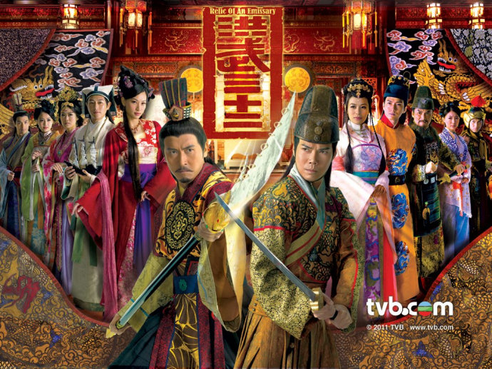
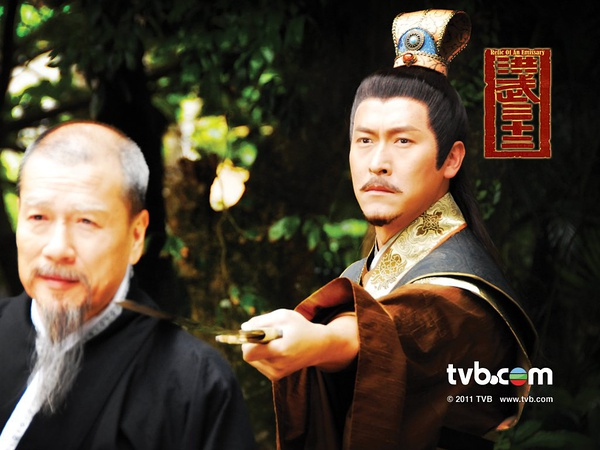
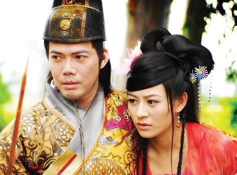

《洪武三十二》

			

 
老公的评论：
 

　　因为小的时候喜欢听评书《明英烈》，所以一直以来对朱元璋打天下的部分很感兴趣，但对后来燕王造反的事情就没有那么熟悉了，关于朱棣篡位，建文帝逃亡海外的事情，大多的信息来源野史小说，所以呢，也不在乎再多看一部演绎的作品。
 

　　我觉得无论怎么说，朱棣都是抢了他侄子的皇位，尽管这是发生在宗族内部的斗争，但篡位就是篡位，我看最近的很多连续剧或者小说，都把朱棣的篡位编成了是被迫的，不管是不是历史，看上去总都是有些古怪。
 

　　马德钟扮演的燕王很有气势，估计是因为他的身高在TVB中有优势吧，而陈山聪扮演的建文帝、陈键锋扮演的三宝太监郑和都从各自的角度演绎了历史人物，相对于谢天华扮演的主人公敖笑风，我觉得这部剧集给我留下最深刻印象的是马三保，陈键锋把妆化的唇红齿白，既显示了角色宦官的身份，但又从另一个层面突出了角色的温文尔雅，我相信如果不了解“郑和下西洋”这段历史的人看了这部连续剧，一定会觉得郑和是历史上最有气质的太监。
 

　　相比较而言，江若琳在剧中扮演的公主多少有些做作，但总要经历这样的阶段，哪个演员也不是每部戏都做到百分之百精彩的，徐子珊在这部戏里看上去比她别的扮相漂亮了不少，是瘦了吗？这样的扮相显得女人味重多了！
 
　　看这部剧集的另一个感慨，来自于看到曾伟权、骆应钧等一代老明星的没落，唉，这就是现实……

老婆的评论：
 

　　看这部电视剧时，让我有点烦躁，并不是这部电视剧演的不够好，而是那种让人觉得很复杂很纠结的人与人之间的关系。互相算计也没什么，甚至明争暗抢也没什么，但这种争抢是以对方性命为基础时，让人感觉很是难受。
 

　　朱棣抢了皇太孙的皇位已经是一个不争的历史，所以电影怎么演，结局是不能再变了。在很多时候我都觉得皇太孙真的挺悲哀的，不管他之前够不够好，他的形象再也不能从好里塑造了。因为四皇叔得是好皇帝才行。像方孝儒的人都愿意为他死十族，可见皇太孙并不太差。
 

　　我遗憾皇太孙没有好的谋士，遗憾皇太孙本来不够豁达，也许他采纳了皇四叔的建议，或许结果会不同，但反过来，要不是来自皇四叔等各位叔叔们的威胁，他也不至于成这样。也或许他留下来的故事都被杜撰了并不真实。
 

　　在这次争位战中，有的是牺牲品，皇四叔的形象也不得我心，貌似他就是阴谋者的形象出场，真的爱不起来。或许是因为他欺负了一个比他弱小的皇太孙，人本能就愿意同情弱者。在看电视剧时问老公，后来朱棣是不是一位好皇帝，老公说还可以。我觉得还算安慰。
 

　　这部电视剧我最讨厌的人是道衍，人家好好的家事，有你什么事，没事就出来捣乱。真是让人烦。还有讨厌电视剧设计的沈千三双生姐妹，让我感觉有点烦。虽然徐子珊演的都不错。
 
　　这部电视剧谢天华演锦衣卫的敖笑风真的不错，而陈键锋演的马三保这一角色恰到好处，只不过过了好久我才知道他是一个太监。

							
		
http://blog.sina.com.cn/s/blog_52187ba90100wr5e.html
