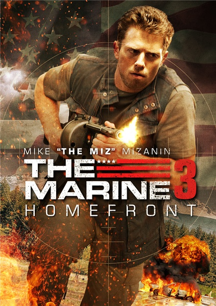
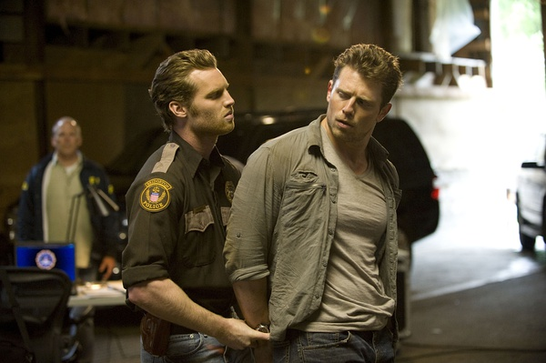
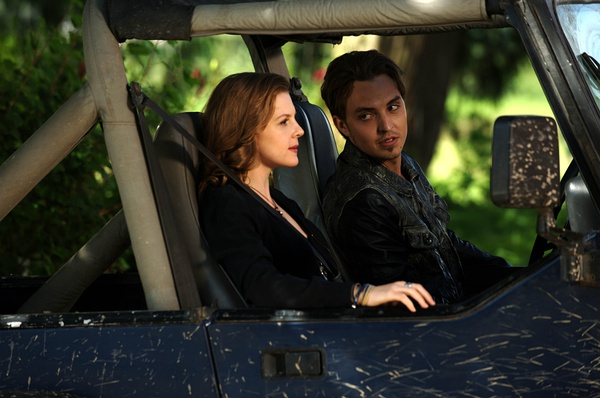

《海军陆战队员3 The Marine3 Homefront》

			

老公的评论：
 
　　其实这部电影的前两部我们都没有看过，我记得忘了是哪部，看过一个开头，看不下去，就放弃了。
 
　　这部电影我觉得很好看，哈，这也是一类电影吧，我甚至都有点记不清主人公们的名字，但是这并不影响我觉得这部电影的好看。
 

　　美国的英雄式电影的魅力就是这样，尽管我们都知道最后主人公一定会打败对手，尽管我们都知道最后一定是壮烈而圆满的结局，但是，这并不影响我们欣赏这部电影的情绪，并不会因为提前知道了结局就觉得过程没有意思。
 

　　这部电影又把FBI写的非常的笨蛋，好像最近流行这么做，无论是FBI、CIA、甚至是特勤局，好像都是由一些笨蛋组成的——我知道了，原来美国出了这么多的英雄，是因为他们的特工们都太笨了，呵呵！

老婆的评论：
 

　　这种电影好像什么时候看都觉得非常不错。故事情节简单，主人公非常的强悍，可以完成不可以完成的任务，适当的亲情点缀一下，让这部非常暴力的影片显得非常的温馨。
 
　　一队FBI的陪衬，更加显得主人公海军陆战队的杰克超级厉害，哈，看美剧多了，这样的安排还真的挺多呢。　　
 
　　其实，真要我形容这部电影哪里好，我也说不出个一二三，但是看的时候会让你非常的享受。

上映年份 2013							
		
http://blog.sina.com.cn/s/blog_52187ba90101hff2.html
