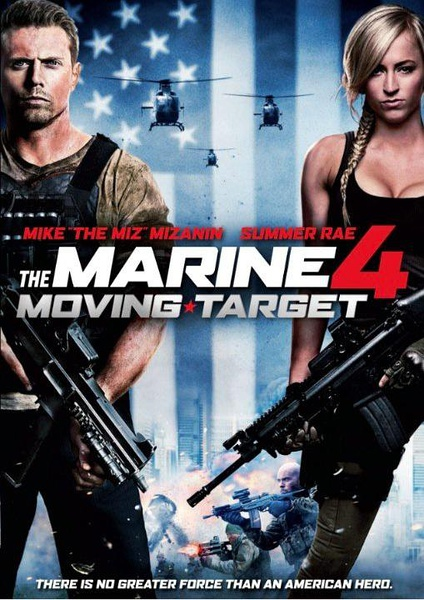
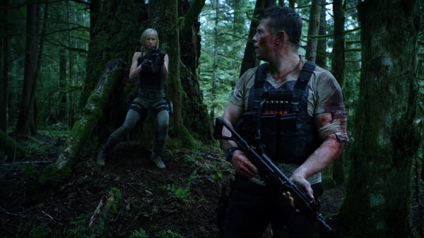

《海军陆战队员4 The Marine 4: Moving Target》

			

老公的评论：

　　《海军陆战队员》系列的电影都算是挺激烈的，这部《Moving
Target》依旧保持了系列的风格，可以说是从头打到尾，让我都来不及去想是否因为不好看而中途放弃。

　　对于这种非常激烈的动作型的电影的故事情节，我总是觉得没有必要去议论评价的，因为总是要打斗，最后主人公总是要获得胜利……

　　值得一提的，是这部电影让我想起了《第一滴血》，杀手团队中的美国司法部官员认为主人公卡特擅长丛林战……，在这么多部美国电影中，还有比兰博更擅长丛林战的吗？

　　电影的剪辑很不错，很多细节并没有过多地去描述，比如卡特如何布置丛林陷阱等等，这样让电影的效率提高了许多，我想大多数观众会用自己的脑子去补足那些场景。

　　有一个地方我没看明白——在进入丛林战之前，两位主人公是从哪里搞到那些枪械装备的，我试图用自己的想象去弄明白，想了许多可能，还是觉得不够完美。

　　这部片子如果要挑毛病的话，就是杀手们几次没有在第一时间开枪打死卡特，才成就了他的英雄事迹，杀手怎么变仁慈了……

老婆的评论：

　　剧情很简单的电影，前海军陆战队员卡特退伍后加入一家私人保镖公司，上班的第一天他要负责保护押送一位叫奥莉维娅的女子，在叛徒的出卖下，最后只剩下他一人还保护住奥莉维娅，顺利的完成任务。

　　看的时候其实挺过瘾的，持续的枪占，绝对的以多战少，卡特把他们引入自己有优势的丛林中，然后把他们都分开，逐一瓦解击破，有美式孤独英雄的感觉。

　　最终那家不良企业受到了惩罚，叛徒也死了，正义得以彰显。

　　真觉得这部电影的影评没什么可写的，总体来说，这部电影值得一看。

上映年份 2015
							
		
http://blog.sina.com.cn/s/blog_52187ba90102vtaj.html
